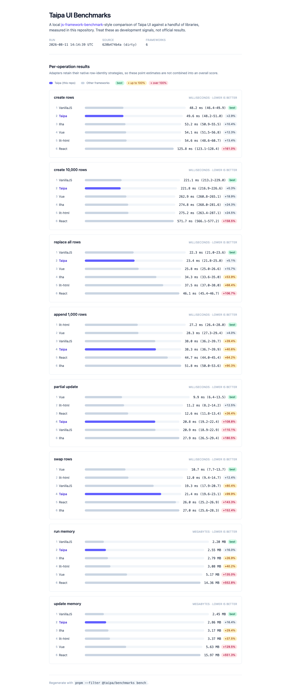

# Taipa Benchmarks

Local benchmark harness inspired by [`krausest/js-framework-benchmark`](https://github.com/krausest/js-framework-benchmark/tree/master).

This first slice compares:

- `taipa`
- `ilha`
- `vanillajs`
- `lit-html`
- `react`
- `vue` (`vue@3.6` is not published on npm at the time of setup; this uses the resolved Vue 3 catalog version)

Implemented operations:

- `create rows` (`#run`, 1,000 rows)
- `create 10,000 rows` (`#runlots`)
- `replace all rows` (`#run` over an existing 1,000-row table)
- `append 1,000 rows` (`#add` over an existing 1,000-row table)
- `partial update` (`#update`, every 10th row)
- `swap rows` (`#swaprows`, rows 2 and 999)
- `run memory` (JS heap after `#run`)
- `update memory` (local extension: JS heap after `#run` + `#update`)

## Results dashboard



Start the dev server to view the results dashboard — a single page that renders the latest run from `src/results.json` with a ranked bar chart per operation:

```sh
pnpm --filter @taipa/benchmarks dev
```

- `http://localhost:5173/` — results dashboard
- `http://localhost:5173/harness.html?framework=taipa` — interactive harness for a single framework
- `http://localhost:5173/harness.html?framework=react`

The dashboard is styled with Tailwind CSS and highlights Taipa across every operation.

## Running the benchmarks

Run the automated local pass:

```sh
pnpm --filter @taipa/benchmarks bench
```

The runner performs five warmup executions and ten measured samples for each framework/CPU operation. Framework and operation positions rotate through deterministically randomized base orders, and every execution gets a fresh page. Setup runs outside the timed interval, and every sample validates the complete final row data and expected DOM identity behavior. The timed browser-local interval starts immediately before the button action and includes two animation frames for DOM settlement. Reports show the sample mean and Student-t 95% confidence interval. Override the sample count with `TAIPA_BENCH_SAMPLES` (2-30), warmups with `TAIPA_BENCH_WARMUPS`, the selected comma-separated adapters with `TAIPA_BENCH_FRAMEWORKS`, the deterministic seed with `TAIPA_BENCH_SEED`, and the slow-operation timeout with `TAIPA_BENCH_ACTION_TIMEOUT`. Memory warmups use a disposable page; each memory operation is then a single validated reading from its own fresh page.

It drives the per-framework harness (`harness.html`), prints one table per operation sorted by point estimate, and records the timestamp, git hash and dirty-worktree state, browser/runtime, host processor, logical core count, architecture, and physical memory in two artifacts:

- `benchmarks/src/results.json` — structured data consumed by the dashboard.
- `benchmarks/BENCHMARK_RESULTS.md` — the same numbers as Markdown tables.

CPU timings are ranked by lower mean milliseconds, with uncertainty shown separately rather than used to assert a definitive ordering. Memory readings are ranked by lower Chromium `JSHeapUsedSize` bytes. The `vs best` column shows the point-estimate percentage slower or heavier than the top-ranked result for that operation. Treat these as local development signals, not official js-framework-benchmark results.

The adapters intentionally exercise their existing DOM strategies: Taipa and VanillaJS replace rows, Ilha reuses positions, and lit-html, React, and Vue preserve keyed nodes. Per-operation charts therefore compare complete adapter behavior, including different identity guarantees. They are not combined into an overall framework score.

## Running the Taipa UI microbenchmarks

Build the packaged UI entry points, then run the Tinybench/CodSpeed suite:

```sh
pnpm --filter @taipa/ui build
pnpm --filter @taipa/benchmarks bench:ui
```

The server-island tasks include small stateful islands plus large, Unicode, escape-heavy, near-limit, and tabular
payloads. They measure the public packaged render path, including validation, inert JSON serialization, and view
rendering. Compare runs on the same machine; these numbers are local regression signals rather than universal claims.

Run the production-browser comparison between Taipa's `repeat()` helper and Lit's keyed
`repeat` directive with:

```sh
pnpm --filter @taipa/benchmarks bench:repeat
```

The repeat runner rebuilds `@taipa/ui`, bundles both libraries in Vite production mode, validates
equivalent output and DOM identity, and prints a Markdown-ready report from headless Chromium.

Run the production-browser serialization benchmark with:

```sh
pnpm --filter @taipa/benchmarks bench:serialization
```

It rebuilds the package, bundles a production Vite fixture, validates the hydrated DOM and sanitized
payload before timing, then reports direct `hydrate()` payload parsing/sanitization separately from
`bootstrap()` DOM JSON-registry and JavaScript-registry resolution paths.

Run the production-browser client lifecycle controls with:

```sh
pnpm --filter @taipa/benchmarks bench:client-lifecycle
```

This benchmark runs four paired comparisons: direct hydration versus mount startup, unrelated and
descendant mutation-heavy workloads with and without a live instance, and dynamic insertion with
`bootstrap({ observe: false })` versus `observe: true`. It consumes packaged public APIs from a
minified production bundle, performs eight warmup and forty measured rounds in deterministic balanced
AB/BA order, validates lifecycle and discovery behavior outside timing, and reports condition and
paired-difference Student-t 95% confidence intervals. The startup paths perform intentionally different
work; each mutation row reports amortized latency in milliseconds per mutation for one batch of 10,000 `textContent`
replacements and one observer delivery.
