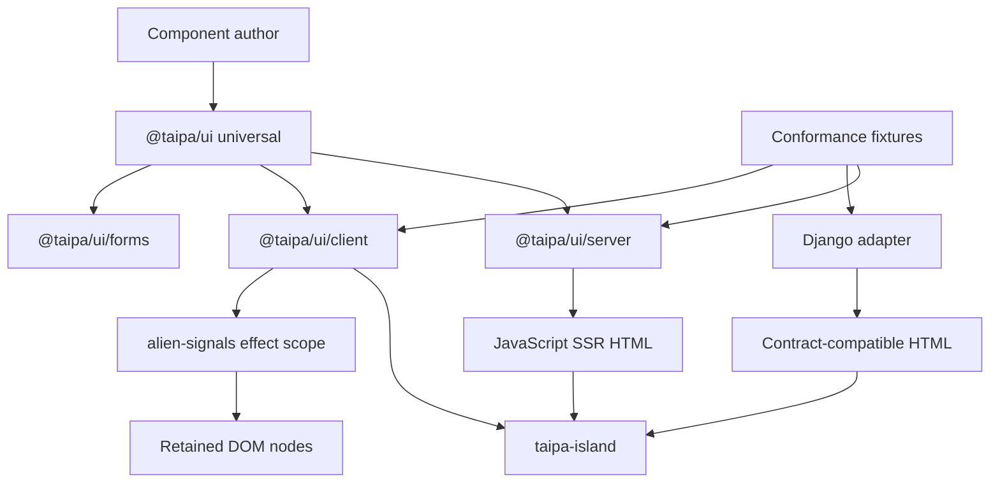
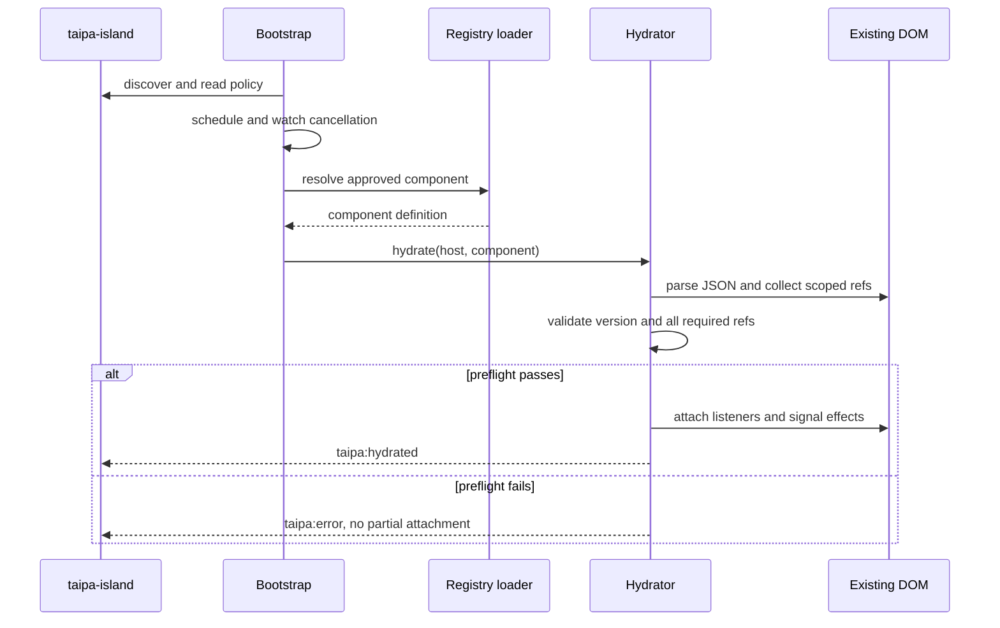
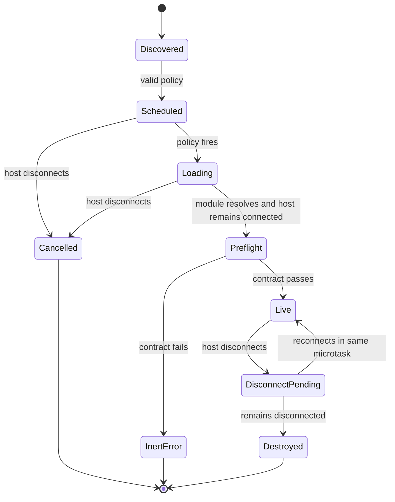
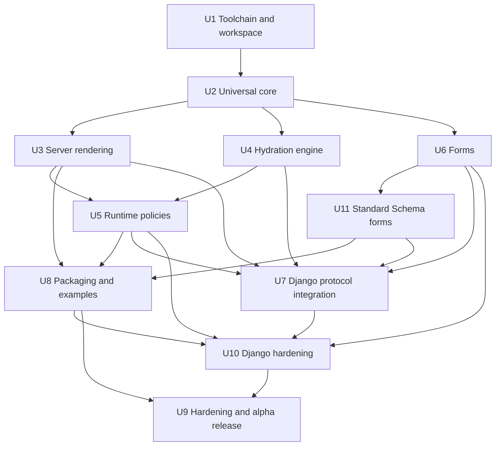

# Taipa UI Framework Alpha - Plan

## Goal Capsule

- **Objective:** Deliver a publishable alpha of `@taipa/ui` that renders on JavaScript servers, hydrates JavaScript- or foreign-server HTML without DOM diffing, updates retained DOM nodes through `alien-signals`, progressively enhances native forms, supports Standard Schema validation adapters, and works from npm or exact-version esm.sh URLs.
- **Authority:** `outputs/taipa-ui-framework-design-plan.md` defines product behavior and public API; this plan defines implementation boundaries and sequencing; verified browser and cross-runtime behavior overrides implementation convenience.
- **Execution profile:** Greenfield, prototype-gated, test-first at contract boundaries, with real-browser proof for DOM behavior and packed-artifact proof for distribution.
- **Stop conditions:** Stop and revisit the design if hydration requires rendering or reconciling a client tree, if foreign-server HTML cannot preserve node identity, or if esm.sh creates incompatible reactive/runtime copies that the documented no-build path cannot prevent.
- **Delivered baseline:** U1-U6 have established the workspace, universal core, server renderer, direct-DOM client runtime, bootstrap policies, and progressive forms. Remaining work starts from those public entrypoints and test patterns rather than probe scaffolding.
- **Tail ownership:** The remaining work includes Standard Schema validation support, package validation, late-phase Django conformance, documentation, an npm prerelease, and exact-version esm.sh verification.

---

## Product Contract

### Summary

Build Taipa as a small ESM-first islands framework whose server HTML remains authoritative after hydration.
The alpha covers the universal component API, JavaScript SSR, direct-DOM client hydration, runtime hydration policies, progressive forms, Standard Schema validation support, a maintained Django adapter, and npm/esm.sh distribution.

### Problem Frame

Most component frameworks assume a build pipeline and hydrate by comparing a client representation with server HTML.
That model does not fit server-rendered applications where Django or another non-JavaScript template engine owns the markup.

Taipa needs one component model that can render on JavaScript servers while also attaching behavior to contract-compatible foreign HTML.
Its update path must be inspectable: signals trigger effects that already retain real DOM references, with no Virtual DOM, template-tree diff, structural reconciliation, or rerender-on-change mechanism.

The repository is greenfield.
The first phase must establish a reproducible multi-language development environment before framework behavior is implemented.

### Actors

- A1. **Component author:** Defines props, state, derived values, events, bindings, effects, and initial HTML.
- A2. **Server-template author:** Emits contract-compatible island markup and progressively enhanced forms without executing Taipa on the server.
- A3. **Application integrator:** Configures component registries, hydration policies, package imports, CSP, and release assets.
- A4. **End user:** Receives useful server HTML first and optional client behavior later; form submission remains functional without JavaScript.
- A5. **Framework maintainer:** Evolves public exports, contract versions, tooling, conformance fixtures, and release validation.

### Requirements

**Rendering and reactivity**

- R1. One component definition must support JavaScript SSR, hydration of existing HTML, and one-time client-only mounting.
- R2. Hydration must not call `render()`, create a client render tree, compare DOM structure, or replace existing server nodes.
- R3. Reactive state must use the public `alien-signals` APIs, with one effect scope per live component instance and direct writes through retained DOM references.
- R4. The universal HTML API must escape supported interpolation contexts, reject ambiguous or executable contexts, and require branded safe values for raw HTML and URLs.

**Island lifecycle and hydration**

- R5. `<taipa-island>` must enforce nested island boundaries, required-ref uniqueness, contract-version compatibility, an untouched validation preflight, resource-safe failure cleanup after commit begins, deterministic mount/unmount cleanup, and one compatible runtime owner per document.
- R6. Runtime policies `load`, `idle`, `visible`, and `only` must work from final HTML attributes without a compiler or application build pipeline, with documented degradation when scheduling APIs are unavailable.
- R7. Module resolution must prefer an explicit JavaScript registry, support an inert page registry, and disable DOM-provided module URLs unless an application resolver approves the exact specifier.
- R8. Removing or replacing an island during scheduling, import, hydration, or async effects must not attach stale behavior or retain live effects.

**Server rendering and foreign-server compatibility**

- R9. `@taipa/ui/server` must serialize inner HTML, island hosts, props, optional state, policies, fallback markup, and contract metadata without importing DOM or Node-specific modules at evaluation time.
- R10. A language-neutral conformance corpus must prove that JavaScript SSR and Django emit the same public island contract even when their static inner markup is not byte-identical.
- R11. The maintained Django adapter must render the template tag contract, validate manifest and policy inputs, and use safe inert-JSON serialization.

**Forms**

- R12. `createForm()` must enhance a real form while preserving native controls, constraint validation, CSRF fields, submitter semantics, autofill, reset behavior, accessibility relationships, file-input ownership, and no-JavaScript submission.
- R13. Async validation and enhanced submission must abort stale work, prevent replay loops, expose pending state, render error text safely, and never silently replay a failed non-idempotent request.
- R19. Standard Schema support must compose with `createForm()` without adding schema-library-specific dependencies, while mapping schema issues into Taipa's safe `FormErrors` and preserving native form semantics.

**Packaging and contributor workflow**

- R14. The JavaScript repository must be a pnpm workspace managed through Vite+, with Vite, Vitest, Oxlint, Oxfmt, type checking, packaging, and task orchestration configured through Vite+.
- R15. `@taipa/ui` must publish one ESM-only npm package with explicit `.`, `/client`, `/server`, and `/forms` exports, declarations, source maps, and no import-time auto-bootstrap.
- R16. Exact-version esm.sh imports must work without a build step and must resolve a compatible Taipa runtime and `alien-signals` instance across public subpaths.
- R17. CI must run static checks, Node tests, real-browser tests, Django tests, conformance fixtures, packed-tarball checks, and build/package boundary checks.
- R18. The alpha documentation must include npm, Node SSR, Django, progressive form, visible hydration, client-only fallback, and no-build esm.sh examples.

### Key Flows

- F1. **JavaScript SSR to hydration**
  - **Trigger:** A JavaScript server imports a component and renders an island.
  - **Actors:** A1, A3, A4.
  - **Steps:** Render initial HTML and inert state; deliver HTML; bootstrap selects a policy; resolve the component; preflight the contract; attach listeners and effects to existing nodes.
  - **Outcome:** The server nodes survive, and later signal changes update only bound nodes.
  - **Covered by:** R1-R9.

- F2. **Django contract hydration**
  - **Trigger:** A Django template tag renders a registered component island.
  - **Actors:** A2, A3, A4.
  - **Steps:** Resolve manifest metadata; render a Django inner template; serialize props; emit the shared host contract; the browser loads the JavaScript component and hydrates the existing HTML.
  - **Outcome:** Django remains the HTML authority while Taipa attaches behavior through required refs.
  - **Covered by:** R5-R11.

- F3. **Deferred runtime activation**
  - **Trigger:** Bootstrap discovers a `load`, `idle`, `visible`, or `only` island.
  - **Actors:** A3, A4.
  - **Steps:** Schedule by policy; cancel if disconnected; resolve the approved module once; preflight; hydrate or render off-DOM; dispatch success or error.
  - **Outcome:** Activation timing matches final-HTML policy without build-time rewriting.
  - **Covered by:** R5-R8.

- F4. **Progressively enhanced form submission**
  - **Trigger:** A user submits a server-rendered form.
  - **Actors:** A2, A4.
  - **Steps:** Native constraints run; Taipa validates if active; invalid fields receive accessible errors; valid forms use either a one-shot native resubmission or the explicit client handler.
  - **Outcome:** The form works with JavaScript disabled and gains race-safe validation or submission when enabled.
  - **Covered by:** R12-R13.

- F5. **No-build consumption**
  - **Trigger:** A page imports exact-version Taipa URLs from esm.sh.
  - **Actors:** A1, A3.
  - **Steps:** An import map pins compatible public subpaths; the page defines a component; bootstrap hydrates server markup; duplicate runtime/reactivity checks remain quiet.
  - **Outcome:** A browser-native ESM page runs without a local build.
  - **Covered by:** R15-R16.

- F6. **Standard Schema form validation**
  - **Trigger:** A component or page author wants a Standard Schema-compatible validator to validate a Taipa-enhanced form.
  - **Actors:** A1, A2, A4.
  - **Steps:** The form reads current native `FormData`; Taipa validates the read value through the schema; schema issues map to form field errors; successful validation continues the existing native replay or enhanced submit path.
  - **Outcome:** Schema-backed validation works without replacing controls, coupling Taipa to a specific validation library, or bypassing the existing async race protections.
  - **Covered by:** R12-R13, R19.

### Acceptance Examples

- AE1. **Retained identity:** Given server HTML containing an output node, when its counter island hydrates and increments, then the original output node remains connected and only its `textContent` changes.
- AE2. **Atomic preflight:** Given a component whose required ref is missing or duplicated, when hydration runs, then no listener or effect attaches, the HTML remains inert, and one `taipa:error` event reports the contract failure.
- AE3. **Visible cancellation:** Given a visible island removed before intersection or while its module imports, when the observer/import completes, then no component instance is created and no detached node is retained.
- AE4. **Client-only fallback:** Given an `only` island with fallback content, when import or render fails, then the fallback remains; when rendering succeeds, then the fallback is replaced once and bindings connect to the new nodes.
- AE5. **Django parity:** Given one shared conformance case, when JavaScript SSR and the Django tag render it, then component name, policy, contract version, refs, props, and state satisfy the same normalized contract.
- AE6. **Native form path:** Given an enhanced form with no submit handler, when async validation succeeds, then one native submission occurs with the original submitter and no validation loop.
- AE7. **Safe validation output:** Given a validator error containing HTML-like text, when errors render, then the text is visible but no new element or executable attribute is created.
- AE8. **No-build import:** Given a published prerelease and its exact-version import map, when the no-build fixture loads in a clean browser, then root and client imports share compatible reactivity/runtime ownership and the counter works.
- AE9. **Entrypoint isolation:** Given a clean Node ESM process, when it imports `@taipa/ui` or `@taipa/ui/server`, then no DOM global is accessed; importing `@taipa/ui/client` performs no mutation, and DOM or runtime mutation begins only when an explicit client operation such as `hydrate()`, `mount()`, or `bootstrap()` is called.
- AE10. **Schema-backed form errors:** Given a Standard Schema-compatible validator that returns nested field issues and hostile message text, when Taipa validates the form, then issues map to the documented form field names, messages render as text only, stale results cannot overwrite newer validation, and a valid form continues through the same submitter-preserving path as non-schema validation.

### Success Criteria

- Every public API proposed in the design document is exported, typed, documented, and covered by a positive and failure-path test.
- The delivered U1-U6 entrypoints remain stable while Standard Schema support is added as a forms-layer adapter, not as a dependency on any specific schema implementation.
- Node SSR and Django pass the same contract fixtures.
- Browser conformance proves node identity, scoped direct writes, scheduling, cancellation, lifecycle cleanup, and form behavior.
- The packed tarball passes export/type validation and clean-consumer imports.
- An npm prerelease is loadable from exact-version esm.sh URLs with the documented import map.
- Baseline bundle size, SSR throughput, hydration latency, per-island allocation, and post-unmount retention measurements are recorded before the alpha is announced.

### Scope Boundaries

**Included**

- One npm package with four public subpath exports.
- One maintained Django adapter and a Django example application.
- Light DOM, runtime island policies, progressive forms, Standard Schema validation support, conformance fixtures, benchmarks, and alpha release documentation.
- Node and real-browser validation, plus Python tests for the Django adapter.

**Deferred to Follow-Up Work**

- Streaming SSR and abortable render streams.
- Shadow DOM or Declarative Shadow DOM adapters.
- A generic keyed collection primitive.
- Rails, Laravel, Go, CMS, and static-generator adapters.
- Independent PyPI publication of the Django adapter; the first npm alpha keeps it installable and tested from the monorepo until the markup contract survives external feedback.
- Organization-specific component generators.

**Outside this product's identity**

- Virtual DOMs, VDOM-like diffing, template-tree reconciliation, rerender-on-signal updates, or compiler-required reactivity.
- Client routing, app shells, server actions, global stores, CSS-in-JS, animation systems, and general SPA replacement.
- Automatic hydration of arbitrary server HTML without explicit contract hooks.

---

## Planning Contract

### Key Technical Decisions

- KTD1. **One JavaScript package, multiple subpaths.** Keep the universal, client, server, and forms surfaces in `packages/ui` and publish them through one explicit exports map. Separate workspace packages would create version skew and weaken the npm/esm.sh contract.
- KTD2. **Vite+ owns the JavaScript toolchain.** Pin `vite-plus@0.2.5` for the initial implementation and configure Vite, Vitest, Oxlint, Oxfmt, type-aware checks, tsdown packaging, and workspace tasks through Vite+. Do not add standalone Vitest, Oxlint, Oxfmt, ESLint, or Prettier configuration unless a documented Vite+ limitation requires it.
- KTD3. **Use the Vite+ monorepo scaffold as inspected input, not as repository authority.** Generate the official scaffold outside the repository, then merge only the files that fit this plan so the existing design artifact and chosen package boundaries remain intact.
- KTD4. **Pin development tools separately from consumer compatibility.** Use Node 24 LTS for development, an exact pnpm release in `packageManager`, an exact Vite+ release, and an exact `alien-signals@3.2.1` workspace catalog entry. Publish `engines.node` as `>=22.12.0` and prove both Node 22.12 and Node 24 against the packed server-safe entrypoints.
- KTD5. **Oxlint/Oxfmt govern JavaScript-facing files; Python gets a narrow tool lane.** Root Vite+ config is authoritative for TypeScript, JavaScript, JSON, Markdown, YAML, and web fixtures. The Django adapter uses a committed `uv.lock`, Ruff, and pytest inside its Python project because Oxc does not parse Python; those tools do not replace the JavaScript formatter or linter.
- KTD6. **Real browsers are the DOM authority.** Use Vitest's Node project for pure and SSR behavior and Browser Mode with Playwright for Custom Elements, observers, focus, constraint validation, node identity, lifecycle, and memory-sensitive behavior. The alpha support contract is the current stable Chromium release; Firefox and WebKit lanes are experimental until they become release gates. A DOM emulator may support isolated helper tests but cannot satisfy conformance.
- KTD7. **Treat HTML/ref/version data as a protocol.** Implement shared contract parsing and language-neutral fixtures before convenience abstractions. Hydration preflight is atomic, contract errors leave markup inert, and nested island traversal is an explicit boundary.
- KTD8. **Keep `alien-signals` external and single-resolved.** Declare it as a normal exact runtime dependency for the alpha and externalize it from library bundles. The supported esm.sh contract maps every exact-version Taipa subpath with `?external=alien-signals` and maps the bare `alien-signals` specifier to its exact version. Taipa's `batch()` is the only wrapper and uses `startBatch()`/`endBatch()` with `try/finally`.
- KTD9. **Runtime directives are data, not syntax.** Use `data-taipa-hydrate` and related attributes in final HTML, with registry-first module resolution and opt-in exact-specifier handling for `data-taipa-src`.
- KTD10. **The server owns initial and fallback HTML.** Hydration never calls `render()`; `mount()` and `only` may render once through a native template; successful `only` rendering replaces fallback atomically after off-DOM completion.
- KTD11. **Package proof uses what consumers receive.** U1 first publishes an explicitly disposable CDN-topology canary after npm ownership is confirmed. U8 validates the real tarball in clean local consumers without publishing it. U9 rebuilds from the release commit, publishes the supported alpha once, and reruns exact-version esm.sh verification against that final artifact. Source imports do not count as distribution proof.
- KTD12. **Vite+ beta upgrades are explicit.** Keep toolchain upgrades separate from feature work and require the full check, test, pack, and fixture matrix after each upgrade.
- KTD13. **Hydration input precedence is explicit.** Explicit `hydrate()` or `mount()` options override inert JSON payloads, which override component state initializers. Duplicate payload scripts, malformed JSON, non-object props, unknown state keys, and initializer failures abort before behavior attaches.
- KTD14. **Hydration separates an untouched preflight from a resource-safe commit.** Props, state, derived setup, versions, and refs validate before DOM mutation. After commit begins, any listener, binding, `.connected()`, or component-effect failure disposes every runtime resource and marks the host errored, but completed arbitrary DOM writes are not generically reversible.
- KTD15. **The document coordinator owns hosts, not bootstrap handles.** Compatible overlapping bootstrap handles share host instances and loader promises. A handle owns discovery subscriptions and schedules it initiated; destroying it cannot unmount an instance still retained by another handle.
- KTD16. **Forms do not programmatically set files.** Remove `File` from `setValue()` because browsers do not allow reliable assignment to native file inputs. Field-filtered validation computes the whole error map and uses the requested field names only to control which completed errors become visible.
- KTD17. **The Django adapter proves the protocol before it becomes a release surface.** Land a minimal Django conformance spike immediately after server rendering and hydration, then harden it after runtime policies and forms. Keep the adapter installable from the monorepo for the npm alpha; defer an independent PyPI release and compatibility promise.
- KTD18. **Parsed page data is untrusted input.** Parse props, state, and inert registries into null-prototype records; read own properties only; reject `__proto__`, `prototype`, and `constructor` keys at every depth; cap each island payload at 64 KiB and the page registry at 256 KiB. Registry sources may be bare/import-map specifiers, same-origin relative URLs, or `https:` URLs; other schemes require an explicit application resolver and never execute by default.
- KTD19. **Template interpolation is allowlist-based.** Permit HTML text, a documented set of inert quoted attributes, and separately validated single-URL attributes. Reject event handlers, `style`, `srcdoc`, `srcset`, meta-refresh content, raw-text elements, unquoted attributes, dynamic names, and other compound or executable grammars until a dedicated branded type and parser exist.
- KTD20. **Releases use short-lived identity, not stored registry tokens.** npm publication uses GitHub OIDC trusted publishing, provenance attestations, a protected release environment, minimal job permissions, tag-to-package-version verification, and third-party Actions pinned to reviewed commit SHAs.
- KTD21. **Standard Schema support is a forms adapter, not a schema dependency.** Keep `@taipa/ui/forms` structurally compatible with Standard Schema V1 by validating the app's existing `read()` output and mapping issues into `FormErrors`. Do not depend on a specific schema library or make transformed schema output replace the live DOM-derived `values()` signal unless a later API revision explicitly adds that contract.

### Output Structure

```text
.
├── .github/
│   └── workflows/
│       ├── ci.yml
│       └── release.yml
├── docs/
│   ├── guide/
│   ├── plans/
│   └── reference/
├── examples/
│   ├── django/
│   ├── no-build/
│   └── node-ssr/
├── integrations/
│   └── django/
│       ├── pyproject.toml
│       ├── uv.lock
│       ├── src/taipa_django/
│       └── tests/
├── packages/
│   ├── conformance/
│   │   ├── fixtures/
│   │   └── src/
│   └── ui/
│       ├── src/
│       │   ├── client/
│       │   ├── forms/
│       │   ├── server/
│       │   └── index.ts
│       ├── tests/
│       │   ├── browser/
│       │   ├── node/
│       │   └── package/
│       ├── package.json
│       └── vite.config.ts
├── benchmarks/
├── package.json
├── pnpm-workspace.yaml
├── tsconfig.json
└── vite.config.ts
```

### High-Level Technical Design

#### Package and runtime topology



#### Hydration protocol



#### Island lifecycle



#### Delivery dependency graph



### Implementation Constraints

- Do not introduce a reactive template-part system, comment-marker ranges, structural directives, or a generic DOM patch function.
- Do not read `window`, `document`, `HTMLElement`, or Node built-ins during evaluation of universal or server entrypoints.
- Do not use `compilerOptions.baseUrl`; Vite+ type-aware checking does not support it reliably. Resolve packages through workspace dependencies and normal exports.
- Keep generated output, coverage, fixture builds, Python artifacts, and packed tarballs outside Oxlint/Oxfmt inputs.
- Every async scheduler, import, validation, and submission generation must have an abort or stale-generation check.
- Error messages from props, validators, manifests, and server responses are always rendered with text APIs.
- Props and state are public page data; tests and docs must never imply secrecy.
- JSON and manifest normalization must defend against prototype pollution, oversized payloads, duplicate registry keys, and unsafe URL schemes before any module load or component initializer runs.

### Phased Delivery

1. **Delivered foundation:** U1-U6 establish the reproducible workspace, safe universal primitives, SSR, direct-DOM hydration, runtime policies, and progressive forms.
2. **Forms ecosystem compatibility:** U11 adds Standard Schema validation support on top of the delivered forms API without changing Taipa's native form ownership model.
3. **Distribution proof:** U8 proves the packed npm and esm.sh topology against the delivered public subpaths and the schema-aware forms surface.
4. **Late foreign-server protocol:** U7 and U10 move Django protocol work to the latest integration phase, after the JavaScript runtime and forms contracts have stabilized.
5. **Alpha:** U9 records performance baselines, documents the framework, publishes the npm prerelease, and verifies esm.sh. The Django adapter remains a tested monorepo artifact for this cycle.

---

## Implementation Units

| Unit | Outcome                                         | Depends on      |
| ---- | ----------------------------------------------- | --------------- |
| U1   | Reproducible Vite+/pnpm development environment | —               |
| U2   | Universal component and signal core             | U1              |
| U3   | Safe native-template SSR                        | U2              |
| U4   | Direct-DOM hydration engine                     | U2              |
| U5   | Bootstrap, registries, and runtime policies     | U3, U4          |
| U6   | Progressive forms                               | U2, U4          |
| U11  | Standard Schema support for forms               | U6              |
| U8   | Packed npm and no-build distribution proof      | U3, U5, U6, U11 |
| U7   | Late Django protocol integration                | U3-U6, U11      |
| U10  | Hardened Django adapter and example             | U7, U8, U11     |
| U9   | Documentation, benchmarks, and npm alpha        | U8, U10         |

### U1. Establish the Vite+ and pnpm development environment

- **Goal:** Create a reproducible workspace that uses Vite+ as the single JavaScript toolchain and has explicit lanes for browser and Django validation.
- **Requirements:** R14, R17; KTD2-KTD6, KTD12.
- **Dependencies:** None.
- **Files:**
  - `package.json`
  - `pnpm-workspace.yaml`
  - `pnpm-lock.yaml`
  - `vite.config.ts`
  - `tsconfig.json`
  - `.node-version`
  - `.gitignore`
  - `.vscode/extensions.json`
  - `.vscode/settings.json`
  - `.github/workflows/ci.yml`
  - `packages/ui/package.json`
  - `packages/ui/tsconfig.json`
  - `packages/ui/vite.config.ts`
  - `packages/conformance/package.json`
  - `integrations/django/pyproject.toml`
  - `integrations/django/uv.lock`
  - `tests/toolchain/type-error.fixture.ts`
- **Approach:**
  - Inspect `vp create vite:monorepo --package-manager pnpm` in a scratch directory and merge the relevant root conventions.
  - Pin Node 24 LTS, the exact pnpm release, `vite-plus@0.2.5`, and the exact shared workspace dependencies.
  - Put shared `fmt`, `lint`, `check`, `run`, and staged-check policy in root `vite.config.ts`; add package-local config only for package-specific test and pack behavior.
  - Enable Oxlint TypeScript rules, type-aware linting, and type checking; configure Oxfmt once through Vite+; do not add standalone Oxc or Vitest config files.
  - Define Vitest Node and Playwright Browser Mode projects and a Django test task.
  - Add the Vite+-compatible Vitest Playwright provider as an exact development dependency and provision the initially supported Chromium binary and Linux dependencies in bootstrap and CI.
  - Initialize the Django integration with `uv`, commit its lockfile, and run Ruff plus pytest through the locked environment.
  - Use the reviewed commit SHA corresponding to `voidzero-dev/setup-vp@v1` in CI and pin every third-party Action by commit SHA; keep package-manager caching distinct from optional Vite Task result caching.
  - Before public paths are embedded, confirm ownership of the `@taipa` npm scope, availability of `@taipa/ui`, trusted-publishing credentials, and the final Python distribution name even though PyPI publication is deferred.
  - Publish one explicitly disposable `0.0.0-cdn-probe.*` canary containing only root and client ESM probes that both import external `alien-signals`; load exact-version esm.sh subpaths with the documented import map and inspect the fetched graph. Deprecate the probe version after recording the result.
- **Execution note:** This is configuration-heavy work; prove it with clean-install and deliberate-failure smoke checks before adding framework code.
- **Patterns to follow:** Vite+ monorepo, check, test, pack, environment, and CI guides listed under Sources & Research.
- **Test scenarios:**
  1. A clean checkout resolves the declared Node and pnpm versions, installs with the frozen lockfile, and reports no environment conflicts.
  2. A temporary intentional TypeScript error in `tests/toolchain/type-error.fixture.ts` makes `vp check` fail; restoring the fixture makes it pass.
  3. A temporary formatting and lint violation is detected through `vp check --fix` without invoking Prettier or ESLint.
  4. Node and browser test projects each run a smoke test in their intended environment.
  5. `uv sync --frozen` reproduces the Django environment, then the Django lane runs Ruff, imports its package, and executes one pytest smoke test independently of pnpm's JavaScript parser.
  6. Node 22.12 and Node 24 clean consumers import every server-safe subpath from a probe tarball.
  7. The disposable CDN probe proves exact-version root and client URLs retain one external bare `alien-signals` mapping; missing npm authority, name conflict, or a duplicated CDN graph stops work before U2.
- **Verification:** The environment can be reproduced locally and in CI with `vp install --frozen-lockfile`, `vp check`, `vp test`, workspace build tasks, and the Django test task; registry authority and CDN topology are proven before U2.

### U2. Implement the universal component and safe-template core

- **Goal:** Implement the public universal types, component builder metadata, `alien-signals` re-exports, batching, safe HTML contexts, and safe URL handling without any DOM or server-runtime dependency.
- **Requirements:** R1, R3-R4, R15; AE7, AE9; KTD1, KTD8, KTD19.
- **Dependencies:** U1.
- **Files:**
  - `packages/ui/src/index.ts`
  - `packages/ui/src/component.ts`
  - `packages/ui/src/reactivity.ts`
  - `packages/ui/src/template/html.ts`
  - `packages/ui/src/template/context.ts`
  - `packages/ui/src/template/escape.ts`
  - `packages/ui/src/template/safe-url.ts`
  - `packages/ui/src/types.ts`
  - `packages/ui/tests/node/component.test.ts`
  - `packages/ui/tests/node/reactivity.test.ts`
  - `packages/ui/tests/node/template.test.ts`
  - `packages/ui/tests/node/safe-url.test.ts`
- **Approach:**
  - Make component definitions immutable metadata plus ordered lifecycle registrations; state signals are created only for an instance.
  - Re-export the selected public `alien-signals` functions and implement `batch()` with balanced `startBatch()`/`endBatch()` calls in `try/finally`.
  - Parse tagged-template contexts against KTD19's allowlist. Generic quoted-attribute escaping is insufficient for executable or compound grammars.
  - Brand `SafeHtml` and `SafeUrl` through private constructors so structural lookalikes cannot be passed accidentally.
  - Record required singular refs from `.bind()` and `.on()` registrations; keep repeated-ref access limited to runtime contexts.
- **Execution note:** Start with hostile interpolation and dependency-tracking tests; the escaping and signal contracts constrain every later unit.
- **Patterns to follow:** Public signatures and interpolation grammar in `outputs/taipa-ui-framework-design-plan.md`.
- **Test scenarios:**
  1. Text and allowlisted inert quoted-attribute interpolation escape HTML-significant characters and flatten allowed arrays while nullish values render nothing.
  2. Dynamic tags or names, unquoted attributes, event handlers, `style`, `srcdoc`, `srcset`, meta-refresh content, raw-text elements, and other compound grammars throw before output.
  3. Plain strings in URL-bearing attributes fail, while approved relative and protocol URLs pass and hostile schemes fail.
  4. `raw()` preserves trusted content and cannot be confused with a plain object carrying similar fields.
  5. State, derived values, effects, cleanup, scopes, and nested batches match `alien-signals@3.2.1`, including cleanup after an exception.
  6. Component builder registrations preserve declaration order, reject duplicate state/derived names, and expose the correct required-ref set.
  7. Importing the root entry in Node does not access DOM or Node globals.
- **Verification:** The root public surface matches the design signatures, hostile-template tests pass, and dependency inspection confirms one external `alien-signals` dependency.

### U3. Implement server rendering and island serialization

- **Goal:** Produce safe component HTML and complete island hosts from JavaScript without a DOM shim.
- **Requirements:** R1, R4, R9-R10, R15; F1; AE9; KTD7, KTD10.
- **Dependencies:** U2.
- **Files:**
  - `packages/ui/src/server/index.ts`
  - `packages/ui/src/server/render.ts`
  - `packages/ui/src/server/island.ts`
  - `packages/ui/src/server/json.ts`
  - `packages/ui/src/server/attributes.ts`
  - `packages/ui/tests/node/render-to-string.test.ts`
  - `packages/ui/tests/node/render-island.test.ts`
  - `packages/ui/tests/node/serialization.test.ts`
  - `packages/ui/tests/node/state-overrides.test.ts`
  - `packages/conformance/fixtures/islands/*.json`
- **Approach:**
  - Instantiate props, state, and derived values for one initial render, then dispose any render-local reactive resources.
  - Serialize host attributes in a deterministic order for fixtures without promising byte-stable output as public behavior.
  - Emit inert JSON scripts with safe escaping for `<`, `>`, `&`, Unicode line separators, and closing-script sequences.
  - Validate props and state recursively as JSON-safe public data before rendering the host.
  - Validate state override keys against declared component state before render and preserve initializer isolation across requests.
  - Emit fallback markup only for `only`, require contract version for hydratable output, and omit hydration metadata for static islands.
- **Execution note:** Build serialization tests before the wrapper renderer so hostile data cannot become a late security retrofit.
- **Patterns to follow:** Server markup contract and `renderToString()`/`renderIsland()` semantics in the origin design.
- **Test scenarios:**
  1. `renderToString()` returns only escaped inner HTML and never emits a host.
  2. `renderIsland()` emits correct attributes and scripts for static, load, idle, visible, and only modes.
  3. Props containing `</script>`, ampersands, angle brackets, non-ASCII text, and Unicode line separators remain inert and round-trip.
  4. Undefined, functions, symbols, cycles, unsupported class instances, and non-finite numbers in hydratable data fail with a path-aware error.
  5. `only` requires or safely omits fallback as designed and never exposes fallback as active component markup.
  6. Concurrent SSR calls do not share state or effect scope.
  7. Explicit server state overrides win over initializers, omitted state uses initializers, and unknown state keys or initializer exceptions fail without leaking render-local effects.
  8. Importing `/server` in a clean Node ESM process performs no DOM access.
- **Verification:** All server fixtures parse as HTML, inert JSON round-trips, concurrent renders remain isolated, and no DOM shim appears in the dependency graph.

### U4. Implement direct-DOM hydration and instance lifecycle

- **Goal:** Attach component behavior atomically to existing nodes and guarantee deterministic cleanup without rendering or reconciling.
- **Requirements:** R1-R5, R8; F1-F2; AE1-AE3, AE9; KTD6-KTD8, KTD10, KTD18.
- **Dependencies:** U2.
- **Files:**
  - `packages/ui/src/client/index.ts`
  - `packages/ui/src/client/hydrate.ts`
  - `packages/ui/src/client/mount.ts`
  - `packages/ui/src/client/refs.ts`
  - `packages/ui/src/client/instance.ts`
  - `packages/ui/src/client/runtime-owner.ts`
  - `packages/ui/src/client/events.ts`
  - `packages/ui/tests/browser/hydrate.test.ts`
  - `packages/ui/tests/browser/refs.test.ts`
  - `packages/ui/tests/browser/lifecycle.test.ts`
  - `packages/ui/tests/browser/mount.test.ts`
  - `packages/ui/tests/browser/hydration-rollback.test.ts`
  - `packages/ui/tests/package/entrypoint-isolation.test.ts`
- **Approach:**
  - Collect refs in one scoped traversal that skips nested island interiors; preflight version and every singular ref before mutating anything.
  - Resolve props and state through KTD13 before creating an instance; reject duplicate payload scripts and invalid serialized shapes.
  - Create one abort controller and one `alien-signals` effect scope per live instance.
  - Attach event listeners with abortable cleanup and run bindings against retained elements.
  - Store instances in a weak host map and reserve document ownership through a global symbol carrying runtime compatibility metadata.
  - Defer disconnect cleanup by one microtask so native moves can reconnect without teardown.
  - Restrict `mount()` to one initial template parse and atomic child installation before using the same hydrate path.
  - Stage state, derived values, contract validation, and ref collection before commit. Once commit begins, record every runtime attachment in a cleanup stack; an exception disposes resources, marks the host errored, and emits one error without claiming to reverse opaque DOM writes already performed by user callbacks.
- **Execution note:** Begin with failing browser tests for node identity, atomic preflight, nested boundaries, and teardown before implementing lifecycle convenience methods.
- **Patterns to follow:** Hydration algorithm, island ownership rules, and immutable-interior policy in the origin design.
- **Test scenarios:**
  1. Covers AE1. Hydration preserves every server node identity and a signal change writes only the bound property or text node.
  2. Covers AE2. Missing, duplicate, or version-mismatched refs produce one error and zero partial listeners/effects.
  3. Parent ref discovery and events cannot reach a nested island; each nested instance hydrates and destroys independently.
  4. Event handlers, binding cleanups, connected cleanups, reactive effects, and abort signals stop exactly once on unmount.
  5. Moving a live host within one document does not recreate state; permanent removal destroys it after the microtask.
  6. `mount()` renders once, installs through a template, and never calls render again after signals change.
  7. A second incompatible runtime owner is rejected without taking over existing instances.
  8. Explicit hydration options override inert payloads; payloads override initializers; malformed or duplicate scripts, unknown state keys, and initializer failures attach nothing.
  9. Fault injection before commit preserves the original DOM and attaches nothing; fault injection during listener attachment, initial bindings, connected hooks, and component effects disposes all runtime resources, marks the host errored, and dispatches one error.
  10. `/client` import alone defines no custom element and changes no global state until an exported operation is called.
  11. Dangerous nested record keys and island payloads over 64 KiB fail before state creation, effects, listeners, or user initializers run.
- **Verification:** Browser instrumentation proves zero node replacement during hydration, scoped writes, complete cleanup, and no renderer invocation in any hydration path.

### U5. Implement bootstrap, registries, and runtime hydration policies

- **Goal:** Discover islands, resolve approved modules, and activate `load`, `idle`, `visible`, and `only` policies from final HTML.
- **Requirements:** R5-R8; F3; AE3-AE4; KTD9-KTD10, KTD18.
- **Dependencies:** U3, U4.
- **Files:**
  - `packages/ui/src/client/bootstrap.ts`
  - `packages/ui/src/client/scheduler.ts`
  - `packages/ui/src/client/registry.ts`
  - `packages/ui/src/client/custom-element.ts`
  - `packages/ui/src/client/discovery.ts`
  - `packages/ui/tests/browser/bootstrap.test.ts`
  - `packages/ui/tests/browser/scheduler.test.ts`
  - `packages/ui/tests/browser/registry.test.ts`
  - `packages/ui/tests/browser/client-only.test.ts`
  - `packages/ui/tests/browser/dynamic-fragments.test.ts`
  - `packages/ui/tests/browser/bootstrap-ownership.test.ts`
- **Approach:**
  - Keep bootstrap side-effect free until called, then define the Custom Element idempotently, scan the root, and optionally observe added hosts.
  - Normalize JavaScript, inert-JSON, and approved DOM-module registry entries into one cached loader contract.
  - Cache loader promises at document scope; share concurrent imports, support multiple exports from one module, and evict failed promises so an explicit rescan can retry.
  - Implement each policy as a cancellable scheduler that rechecks connection and generation state before and after import. Degrade `idle` to after-load or next-macrotask scheduling, and degrade `visible` to `load` when the relevant browser API is unavailable.
  - Render `only` content off-DOM, preflight it, then replace the marked fallback atomically only after success.
  - Keep client-only fallback truthful and untouched on failure. The worked example includes a server-authored `role="alert"` region whose text is updated through `onError` or `taipa:error`; the runtime never injects trusted HTML into it.
  - Coordinate overlapping roots at document scope. `BootstrapHandle.destroy()` cancels its own observers and pending schedules and releases its host claims; a host is unmounted only when no compatible handle retains it.
- **Execution note:** Treat scheduler cancellation as core behavior, not cleanup after the happy paths.
- **Patterns to follow:** Policy semantics, registry precedence, and `resolveDomModule()` capability boundary in the origin design.
- **Test scenarios:**
  1. `load` requests one component module immediately and deduplicates concurrent hosts using the same loader.
  2. `idle` uses `requestIdleCallback` with timeout and follows the documented fallback when the API is unavailable.
  3. `visible` applies the configured root margin, loads once on intersection, and disconnects its observer afterward.
  4. Covers AE3. Removing a scheduled or loading island prevents activation after callbacks or imports settle.
  5. Covers AE4. `only` retains fallback on load/render/preflight failure and replaces it once after off-DOM success.
  6. JavaScript registry entries override inert registry entries; DOM module URLs do nothing without an approving resolver.
  7. Concurrent hosts share one import; different approved exports resolve from that module; a rejected import is evicted and succeeds after an explicit retry.
  8. Invalid policy, timeout, or root margin reports an error; missing idle/visibility APIs use the documented degradation; static islands never resolve modules.
  9. Malformed registry JSON, unknown policies, missing components, export mismatches, and contract mismatches dispatch errors without executing unapproved code.
  10. Dynamically inserted fragments are scanned once, nested discoveries remain scoped, and a removed unhydrated host can be scheduled after reinsertion.
  11. Compatible overlapping handles share one instance; destroying one preserves hosts retained by another; repeated destroy calls are harmless.
  12. A client-only import, preflight, or render failure preserves truthful fallback content and updates the existing alert region with text-only error handling.
  13. Duplicate registry keys, dangerous nested keys, a registry over 256 KiB, and disallowed URL schemes fail before any dynamic import; approved bare, relative, and `https:` sources retain exact-specifier identity.
- **Verification:** The browser suite exercises every policy with success, failure, cancellation, and host-removal paths while module request counts remain deterministic.

### U6. Implement progressively enhanced forms

- **Goal:** Add validation and optional submission behavior to native forms without replacing controls or breaking server fallback.
- **Requirements:** R12-R13; F4; AE6-AE7.
- **Dependencies:** U2, U4.
- **Files:**
  - `packages/ui/src/forms/index.ts`
  - `packages/ui/src/forms/controller.ts`
  - `packages/ui/src/forms/values.ts`
  - `packages/ui/src/forms/validation.ts`
  - `packages/ui/src/forms/errors.ts`
  - `packages/ui/src/forms/submission.ts`
  - `packages/ui/tests/browser/forms-values.test.ts`
  - `packages/ui/tests/browser/forms-validation.test.ts`
  - `packages/ui/tests/browser/forms-submission.test.ts`
  - `packages/ui/tests/browser/forms-destroy.test.ts`
- **Approach:**
  - Use delegated form events and fresh `FormData` reads; signals mirror current state but do not control input values.
  - Track validation and submission generations with abort controllers so stale results cannot update the form.
  - Preserve browser constraint validation and the original submitter before application validation.
  - Build `FormData` with the original submitter where supported, honor `formnovalidate`, and treat application validity as native validity plus current application errors.
  - Define `formnovalidate` as bypassing native constraint checks and Taipa application validation for that submit attempt while still using the chosen native or enhanced submission path.
  - Use a one-shot bypass token around `requestSubmit(originalSubmitter)` when no enhanced submit handler exists.
  - Adopt server-rendered invalid state from existing `aria-invalid` attributes and `[data-taipa-error-for]` containers without a duplicate initial live-region announcement; preserve all pre-existing `aria-describedby` tokens.
  - Capture native `invalid` events without preventing browser validation UI, synchronize only Taipa-owned ARIA state, and coalesce one form-status announcement per validation attempt.
  - Maintain one error record and container per field name. Apply the preserved error-container ID to every applicable enabled control in a repeated-name group and focus its first focusable invalid member.
  - Normalize validator and server-returned `FormErrors` into null-prototype records of bounded string arrays. Find controls and error containers through exact attribute comparison or `CSS.escape`, never raw selector interpolation.
  - Keep file inputs user-controlled; `setValue()` updates supported text, select, checkbox, radio, and multi-select controls before rereading `FormData`.
  - On destroy, restore only attributes and control state Taipa changed, preserve server-authored ARIA/disabled state and current values, and abort pending work.
- **Execution note:** Write native-submission and race tests before the async controller to guard against duplicate POSTs.
- **Patterns to follow:** Forms behavior and `FormErrors` contract in the origin design.
- **Test scenarios:**
  1. Initial values, repeated controls, checkboxes, radio groups, selects, empty fields, and files are read without changing native controls.
  2. Submit, blur, and input modes expose the intended errors while untouched-field visibility follows policy.
  3. A newer validation aborts an older async validation; only the latest completed generation changes errors and valid state.
  4. Covers AE6. A valid form with no submit handler performs exactly one native submission with the original named submit button.
  5. A native required-field failure and an application-validator failure each focus the first eligible invalid control and produce one form-level announcement without suppressing native validation UI.
  6. Covers AE7. HTML-like and hostile error strings create text only.
  7. An enhanced submission includes CSRF and file data, disables only opted-in buttons, ignores stale responses, and never falls back automatically after network failure.
  8. Enter-key submission, multiple named submitters, image submitters where supported, rapid double-submit, reset during validation, and destroy during submission preserve native semantics; a named save-draft submitter with `formnovalidate` bypasses native and application validation.
  9. `setValue()` updates supported controls and repeated-name groups but rejects file assignment; disabled controls and user-selected files follow native `FormData` behavior.
  10. Field-filtered validation computes the full validator result but exposes completed errors only for requested/touched fields.
  11. Validator or submit-handler rejection clears pending state, aborts stale work, reports the form error event, and remains retryable.
  12. A server-returned invalid form initializes errors and touched state from existing markup, preserves description tokens, and emits no duplicate initial live announcement.
  13. Radio, checkbox, and repeated-text groups share one field error; every enabled applicable control receives the error description, disabled members are skipped, and the first focusable member receives focus.
  14. Field names containing selector metacharacters and prototype-special strings cannot redirect error writes or pollute controller state; oversized or non-string error payloads fail safely.
  15. Reset, autofill-related changes, controller destroy, and re-enhancement restore only Taipa-owned mutations without duplicate listeners.
- **Verification:** Tests pass in a real browser with JavaScript-enabled behavior, and the example form still posts successfully when client enhancement is omitted.

### U11. Add Standard Schema support for progressive forms

- **Goal:** Let form authors validate Taipa form values with Standard Schema-compatible validators while preserving the delivered `createForm()` lifecycle, native submitter semantics, and safe `FormErrors` rendering.
- **Requirements:** R12-R13, R19; F4, F6; AE6-AE7, AE10; KTD16, KTD21.
- **Dependencies:** U6.
- **Files:**
  - `packages/ui/src/forms/index.ts`
  - `packages/ui/src/forms/controller.ts`
  - `packages/ui/src/forms/errors.ts`
  - `packages/ui/src/forms/standard-schema.ts`
  - `packages/ui/src/types.ts`
  - `packages/ui/tests/browser/forms-standard-schema.test.ts`
  - `packages/ui/tests/package/entrypoint-isolation.test.ts`
  - `scripts/verify-consumer.mjs`
- **Approach:**
  - Add a small forms-layer adapter around the delivered `validate` hook rather than replacing the controller or requiring a schema library dependency.
  - Define Taipa's local structural Standard Schema V1 type surface in public types or forms-specific types so consumers can pass compatible schemas without importing `@standard-schema/spec` through Taipa declarations.
  - Validate the app's existing `read()` output. This keeps form value shaping under the application author, avoids inventing a lossy `FormData` object convention, and preserves the current `values()` signal as DOM-derived form state.
  - Map `issues` into Taipa `FormErrors` using a documented default path-to-name policy: string and number path keys join with dots, `{ key }` path segments behave like their key, and missing paths map to a documented form-level key. Expose a narrow mapper option if the implementation needs bracket-style field names.
  - Treat schema validation as application validation: `formnovalidate` bypasses it for that submit attempt, stale generations cannot apply its issues, and successful validation continues the same native replay or enhanced submit path already proven by U6.
  - Preserve schema issue order per field, route all messages through existing text-only error rendering, and reuse existing dangerous-key and oversized-error hardening.
  - Treat thrown or rejected schema validation as a retryable validation failure that clears pending state, prevents submission, and surfaces a form-level error rather than replaying a native POST.
- **Execution note:** Start with schema issue mapping, transform, and async-race browser tests so the adapter cannot bypass the delivered form safety guarantees.
- **Patterns to follow:** Delivered `packages/ui/src/forms/controller.ts`, `packages/ui/src/forms/errors.ts`, `packages/ui/src/forms/values.ts`, and the Standard Schema V1 interface from `https://standardschema.dev`.
- **Test scenarios:**
  1. Covers AE10. A schema returning `{ value }` for valid `read()` output clears previous schema errors and allows the existing native replay path to submit exactly once with the original submitter.
  2. A schema returning issues for `title` maps them to `errors().title`, marks matching controls invalid, and populates the matching `data-taipa-error-for="title"` container with text only.
  3. Multiple issues for one path preserve Standard Schema issue order in the resulting `FormErrors` array.
  4. Nested paths such as `user.email`, array paths such as `items.0.name`, and `{ key }` path segments map to the documented field-name format.
  5. Pathless issues map to the documented form-level key and render in the matching form-level error container without attaching to an arbitrary control.
  6. A schema that transforms `{ age: "42" }` into `{ age: 42 }` does not replace the live `values()` signal unless the adapter exposes the transformed value through its documented helper contract.
  7. Two async schema validations racing on input or submit apply only the newest result; the older result cannot reintroduce errors or flip `valid()`.
  8. A submitter with `formnovalidate` skips Standard Schema validation but still follows the selected native or enhanced submission path.
  9. Files, checkbox groups, radio groups, multi-selects, and repeated fields reach the schema through the app's `read()` output rather than a hidden Taipa object convention.
  10. A schema issue path containing `__proto__`, `prototype`, or `constructor` cannot pollute objects or redirect error rendering.
  11. A schema `validate()` throw or rejected promise prevents submission, clears pending state, renders a form-level retryable error, and allows a later valid submission to proceed.
  12. Destroying the form controller while schema validation is pending aborts or ignores the late schema result and leaves no Taipa-owned ARIA or listener state behind.
- **Verification:** Browser tests prove schema-backed validation composes with native replay, enhanced submit, formnovalidate, race cancellation, and text-only error rendering; the `/forms` packed entry remains side-effect free and does not import schema libraries.

### U8. Package the library and create consumer examples

- **Goal:** Prove that the actual packed artifact satisfies the four-entrypoint npm contract and is ready for one final alpha publication.
- **Requirements:** R15-R16, R19; F5-F6; AE9-AE10; KTD1, KTD8, KTD11, KTD21.
- **Dependencies:** U3, U5-U6, U11.
- **Files:**
  - `packages/ui/package.json`
  - `packages/ui/vite.config.ts`
  - `packages/ui/tests/package/exports.test.ts`
  - `packages/ui/tests/package/tarball.test.ts`
  - `packages/ui/tests/package/reactivity-singleton.test.ts`
  - `tests/consumers/node-esm/`
  - `tests/consumers/vite-browser/`
  - `tests/consumers/deno/`
  - `examples/node-ssr/`
  - `examples/no-build/index.html`
  - `examples/no-build/component.js`
  - `examples/no-build/import-map.json`
  - `scripts/verify-package.mjs`
  - `scripts/verify-esm-sh.mjs`
- **Approach:**
  - Configure `vp pack`/tsdown with four ESM entries, declarations, source maps, tree-shaking, and `alien-signals` externalization.
  - Keep the explicit source-controlled exports map and verify every target file exists in the tarball.
  - Run package metadata validation and install the tarball into clean Node and browser fixtures.
  - Make the local no-build proxy preserve the final import-map shape: every Taipa subpath has an exact placeholder version and externalized `alien-signals`, while the bare `alien-signals` specifier resolves once.
  - Leave this implementation artifact unpublished; U9 alone publishes the supported alpha and repeats the network-dependent esm.sh verification against the release commit.
- **Execution note:** Test the tarball, not workspace source; source-linked examples can hide missing exports and bundled dependency mistakes. The U1 probe proves CDN topology, while this unit proves the actual package contents.
- **Patterns to follow:** Vite+ pack/tsdown guidance and the origin design's package export map.
- **Test scenarios:**
  1. The tarball includes only intended runtime files, declarations, source maps, metadata, license, and documentation.
  2. Clean Node ESM imports of root and server succeed; root, server, forms, and client declarations resolve without private source paths.
  3. A clean Vite consumer imports root, client, and forms; tree-shaking excludes unused entrypoints.
  4. Root and server evaluation contain no DOM access; client import has no bootstrap side effect; forms does not pull in the island scheduler.
  5. The packed `/forms` entry exposes the Standard Schema helper types or adapter functions without importing a concrete schema implementation.
  6. All public subpaths observe one compatible `alien-signals` graph in packed consumers, and the local ESM proxy retains the external bare import required by the final import map.
  7. The no-build counter hydrates and updates in a clean browser using the packed package through a local ESM proxy that preserves the final exact-version import-map shape.
  8. A Deno smoke import succeeds for universal and server-safe surfaces or records a release-blocking compatibility defect.
  9. Invalid or missing exports, accidental CJS output, duplicate reactivity, and unexpected Node built-ins fail package verification.
- **Verification:** `vp pack` produces a validated tarball and clean consumers pass without publishing an incomplete alpha.

### U7. Prove the portable markup contract with Django in the final integration phase

- **Goal:** Validate Taipa's foreign-server claim after the JavaScript runtime, forms, and Standard Schema contracts have stabilized by running shared island and form fixtures through JavaScript SSR, Django output, and real-browser hydration.
- **Requirements:** R10-R11, R17, R19; F2, F6; AE5, AE10; KTD5, KTD7, KTD17, KTD21.
- **Dependencies:** U3-U6, U11.
- **Files:**
  - `packages/conformance/src/index.ts`
  - `packages/conformance/src/normalize.ts`
  - `packages/conformance/fixtures/islands/*.json`
  - `packages/conformance/fixtures/forms/*.json`
  - `packages/conformance/tests/contract.test.ts`
  - `integrations/django/pyproject.toml`
  - `integrations/django/uv.lock`
  - `integrations/django/src/taipa_django/templatetags/taipa.py`
  - `integrations/django/tests/test_protocol_integration.py`
- **Approach:**
  - Define fixtures as language-neutral inputs plus normalized contract expectations, not JavaScript-rendered golden strings.
  - Implement only enough Django output to emit contract-compatible islands, inert JSON payloads, registry metadata, and form markup needed by the shared fixtures.
  - Normalize JavaScript and Django HTML to the same semantic record, then hydrate the Django output in Browser Mode and update retained nodes.
  - Include at least one progressively enhanced form fixture that can be validated by the Standard Schema adapter after hydration without giving Django a JavaScript-only path.
  - Record any protocol change as a design-plan amendment before U10 or U9 builds on it.
- **Execution note:** Treat protocol compatibility as the work, not Django convenience. This unit is complete only when the cross-language browser path works or the protocol is explicitly redesigned.
- **Patterns to follow:** Django's native template and JSON escaping primitives; no JavaScript implementation details may leak into the fixture schema.
- **Test scenarios:**
  1. Covers the core of AE5. JavaScript and Django counter output normalize to the same component, policy, contract version, ref, props, and state contract.
  2. The Django fixture safely serializes a hostile nested value without closing the inert script.
  3. Browser hydration of Django output updates the original counter text node without replacing it.
  4. A Django-rendered form keeps native submission useful with JavaScript omitted and receives the same Standard Schema-backed field errors after Taipa enhancement is loaded.
  5. Invalid fixture data for props, state, registry source, form error names, or schema issue mapping fails in the normalizer before browser hydration.
- **Verification:** The same fixture corpus passes in Node, Python, and a real browser after U11, proving the late Django protocol path consumes the stabilized JavaScript and forms contracts.

### U10. Harden the Django adapter and example

- **Goal:** Turn the successful late-phase protocol integration into a maintained golden-path adapter without adding an independent registry release to the first alpha.
- **Requirements:** R10-R11, R17, R19; F2, F6; AE5, AE10; KTD5, KTD7, KTD17, KTD21.
- **Dependencies:** U7, U8, U11.
- **Files:**
  - `packages/conformance/fixtures/islands/*.json`
  - `integrations/django/src/taipa_django/apps.py`
  - `integrations/django/src/taipa_django/conf.py`
  - `integrations/django/src/taipa_django/manifest.py`
  - `integrations/django/src/taipa_django/templatetags/taipa.py`
  - `integrations/django/src/taipa_django/templates/taipa/registry.html`
  - `integrations/django/tests/test_manifest.py`
  - `integrations/django/tests/test_template_tag.py`
  - `integrations/django/tests/test_conformance.py`
  - `examples/django/`
- **Approach:**
  - Expand the proven block tag around a validated manifest, Django-safe JSON serialization, registry emission, and all hydration policies.
  - State the safety boundary explicitly: Taipa protects adapter-generated host attributes and inert JSON, while Django owns inner-template safety. Require autoescaping and prohibit untrusted values in URL, `style`, `srcdoc`, or other executable and compound contexts.
  - Make unknown components, policies, exports, versions, and unsafe module data fail during server rendering with template-context diagnostics.
  - Run the complete shared fixture corpus through JavaScript SSR, Django output, and browser hydration.
  - Include the documented progressive form and Standard Schema example in the Django golden path without making the Python adapter validate with JavaScript schemas on the server.
  - Keep the Python project buildable and installable from its wheel, but defer PyPI publication and a long-term cross-version compatibility promise.
- **Execution note:** Adapter behavior extends the language-neutral protocol; it cannot create a Django-only hydration path.
- **Patterns to follow:** The U7 protocol integration, the Django tag example and manifest contract in the origin design, and Django's native template and JSON escaping primitives.
- **Test scenarios:**
  1. Covers AE5 fully. JavaScript and Django output normalize to the same component, policy, contract version, refs, props, state, export, and fallback contract across the corpus.
  2. Unknown component names, invalid policies, manifest schema errors, version omissions, and unsafe source values fail with useful diagnostics.
  3. Registry emission deduplicates components and preserves exact approved module specifiers.
  4. Django-generated load, visible, idle, and only islands hydrate in the real-browser conformance suite.
  5. The Django example submits and validates its plain form with JavaScript disabled, then gains Taipa behavior when enabled.
  6. The Django example demonstrates schema-backed client validation after enhancement while server-side Django validation remains authoritative on postback.
  7. A wheel built from the monorepo installs into a clean Python environment and passes an import plus template-render smoke test.
  8. Django fixtures keep autoescaping enabled and prove hostile URL, `style`, and `srcdoc` values are rejected or rendered only in inert text contexts.
- **Verification:** Both runtimes consume the full fixture corpus, the wheel install test passes, and the example proves end-to-end hydration and progressive forms.

### U9. Harden, document, benchmark, and release the alpha

- **Goal:** Turn the feature-complete implementation into a supportable alpha with evidence for its safety, performance, and compatibility claims.
- **Requirements:** R1-R19; all acceptance examples; KTD12, KTD20-KTD21.
- **Dependencies:** U8, U10.
- **Files:**
  - `README.md`
  - `LICENSE`
  - `CONTRIBUTING.md`
  - `SECURITY.md`
  - `docs/guide/getting-started.md`
  - `docs/guide/django.md`
  - `docs/guide/forms.md`
  - `docs/guide/standard-schema.md`
  - `docs/guide/hydration-policies.md`
  - `docs/guide/no-build.md`
  - `docs/reference/public-api.md`
  - `docs/reference/markup-contract.md`
  - `docs/reference/security.md`
  - `benchmarks/ssr.bench.ts`
  - `benchmarks/hydration.browser.test.ts`
  - `benchmarks/memory.browser.test.ts`
  - `.github/workflows/release.yml`
  - `CHANGELOG.md`
- **Approach:**
  - Convert every design prototype gate into a CI or release-check outcome.
  - Add hostile-input, CSP/CORS guidance, version-skew, runtime-owner, and lifecycle-race coverage.
  - Document Standard Schema support as a forms-layer adapter, including the default path-to-name mapping, form-level issue key, transform boundary, and lack of concrete schema-library dependency.
  - Record bundle size, SSR throughput, hydration time, per-island overhead, and memory after unmount on a documented baseline environment.
  - Document the exact limits lost relative to Astro build-time directives and the explicit import-map/module-registry responsibilities.
  - Publish an npm prerelease, run CDN verification, and publish the alpha notes with known limitations. Build and install-check the Django adapter from the monorepo but do not publish it independently in this cycle.
  - Release from a protected environment with GitHub OIDC npm trusted publishing, provenance, least-privilege permissions, immutable Action pins, and a check that the signed tag version equals the packed package version.
- **Execution note:** Keep benchmarks informational until stable baselines exist; correctness, cleanup, and package-contract failures block the alpha.
- **Patterns to follow:** Prototype gates and risk list in the origin design.
- **Test scenarios:**
  1. Every worked example is executed in CI or a release smoke workflow rather than copied only into documentation.
  2. Hostile props, state, URLs, templates, registry data, validation messages, and manifest values remain inert.
  3. Standard Schema issue messages and paths remain text-only, prototype-safe, and race-safe in release examples.
  4. All policy/lifecycle races pass under repeated browser runs, including disconnect during import and bfcache-style reconnect.
  5. Package size reports attribute universal, client, server, forms, Standard Schema adapter, and external `alien-signals` costs separately.
  6. Memory tests show instances, hosts, listeners, and effects become collectible after unmount within the test harness's supported observation model.
  7. The upgrade rehearsal for Vite+ or `alien-signals` runs the full verification matrix and detects an intentionally introduced compatibility break.
  8. Release workflows refuse to publish with a dirty generated surface, failing conformance, missing changelog, invalid package, or unverified esm.sh prerelease.
  9. Covers AE8. The final published alpha's exact-version esm.sh import map hydrates and updates the no-build counter, and fetched modules retain the external singleton contract proven by the U1 probe.
  10. A dry-run release proves no long-lived npm token is present, all third-party Actions are SHA-pinned, provenance is attached, and tag/package versions match.
- **Verification:** The full Verification Contract passes, benchmark results are recorded, documentation examples execute, known alpha limitations are explicit, and prerelease artifacts are reachable from their supported registries.

---

## System-Wide Impact

- **Public compatibility:** The component builder, four package entrypoints, markup attributes, lifecycle events, form validation adapter behavior, error behavior, and Django manifest become versioned public contracts.
- **Security:** HTML context handling, JSON escaping, URL approval, registry resolution, and text-only error rendering are security boundaries and require hostile-input tests.
- **Performance:** Direct DOM writes reduce update work, but bootstrap discovery, ref scans, observers, module loading, and per-island scopes still need measurement.
- **Accessibility:** Taipa preserves native HTML but cannot repair inaccessible server markup; forms own error association, pending state, and focus behavior.
- **Operations:** npm, esm.sh, browser CSP/CORS, cache-busted registries, and version skew create a multi-surface release tail; a later PyPI release will add a second compatibility surface.
- **Contributor experience:** Vite+ simplifies the JavaScript lane, while the Django adapter adds a separate Python runtime that CI and contributor docs must make explicit.

---

## Risks and Dependencies

- **Vite+ beta churn:** `vite-plus@0.2.5` is pre-1.0. Exact pinning and isolated upgrade work reduce surprise, but config or command behavior may still change.
- **Experimental type-aware path:** Vite+ uses the TypeScript Go/Oxlint path, with constraints such as no `baseUrl`. The deliberate type-error smoke test prevents silent loss of type checking.
- **Duplicate signal runtimes:** Separate esm.sh subpath requests may bundle dependency copies differently. The no-build import map and prerelease singleton test are alpha blockers.
- **Foreign markup drift:** Ref/version checks catch protocol drift, not semantic or accessibility drift. Shared normalized fixtures and end-to-end Django examples reduce but cannot eliminate it.
- **Custom Element lifecycle variance:** DOM moves, history restoration, fragment swaps, and browser differences can expose cleanup races. Real-browser tests must cover Chromium first and add Firefox/WebKit before stable release.
- **Async form races:** Validation, submitter preservation, and stale responses can duplicate or misroute submissions. Generation and abort tests are required before release.
- **Schema path ambiguity:** Standard Schema issue paths do not inherently know HTML field naming conventions. The adapter must document its default path-to-name mapping and keep escape hatches narrow enough that error rendering remains exact-name and prototype-safe.
- **Network-dependent release proof:** esm.sh cannot validate unpublished local artifacts. Prerelease publication and CDN checks belong in the release lane, not the fast local suite.
- **Multi-language maintenance:** pnpm/Vite+ does not cover Python. The Django adapter needs its own dependency lock, tests, linting, packaging, and release documentation.
- **No-build security:** esm.sh offers convenience but cannot substitute for an application CSP, exact version pinning, or self-hosting where supply-chain controls require it.

---

## Verification Contract

| Gate               | Command or environment                                    | Proves                                                                     | Applies to            |
| ------------------ | --------------------------------------------------------- | -------------------------------------------------------------------------- | --------------------- |
| Environment        | `vp env doctor`                                           | Node and pnpm declarations agree with Vite+ resolution                     | U1                    |
| Install            | `vp install --frozen-lockfile`                            | Workspace can be reproduced from committed metadata                        | All units             |
| Static checks      | `vp check`                                                | Oxfmt, Oxlint, and type-aware checks pass from shared config               | All units             |
| Node tests         | `vp test --project node`                                  | Universal, template, SSR, serialization, and package helpers               | U2-U3, U7-U8, U10-U11 |
| Browser tests      | `vp test --project browser`                               | Real DOM hydration, policies, lifecycle, forms, and schema validation      | U4-U7, U9-U11         |
| Workspace build    | `vp run -r build`                                         | Dependency-ordered workspace outputs build                                 | U3-U11                |
| Library package    | `vp pack` in `packages/ui`                                | ESM entries, declarations, and source maps are generated                   | U8-U9                 |
| Package consumers  | `vp run package:verify`                                   | Tarball contents, exports, types, clean installs, and singleton behavior   | U8-U9                 |
| Node compatibility | clean consumers on Node 22.12 and Node 24                 | Every server-safe packed subpath honors `engines.node`                     | U1, U8-U9             |
| Django             | `uv sync --frozen`, Ruff, pytest, and wheel install smoke | Template tag, manifest, serialization, conformance, and clean installation | U1, U7, U9-U10        |
| Benchmarks         | `vp run benchmark`                                        | Bundle, SSR, hydration, and retention baselines are recorded               | U9                    |
| CDN smoke          | `vp run esm-sh:verify -- <exact-version>`                 | Disposable topology probe and final published browser imports work         | U1, U9                |

CI must run all non-network gates for every pull request.
The CDN smoke runs only after an npm prerelease exists and must block promotion of that prerelease to the documented alpha tag.

---

## Definition of Done

- R1-R19 are implemented and traceable to passing unit, integration, browser, conformance, package, or release tests.
- AE1-AE10 pass against actual server HTML, real browser APIs, Django output, schema-backed form validation, and packed/published artifacts as applicable.
- The public TypeScript declarations and package exports match the design document without undocumented top-level exports.
- Hydration contains no render call, client tree, DOM comparison, reconciliation, or fallback subtree replacement outside the explicit `mount()` and successful `only` paths.
- `alien-signals` is externally declared, compatibility-pinned, and single-resolved in supported npm and esm.sh examples.
- The Django adapter and JavaScript renderer pass the same portable conformance corpus.
- JavaScript-disabled forms and server HTML remain useful before and after the enhancement code ships.
- Standard Schema support is documented as a structural adapter, keeps `values()` tied to native form reads, maps issues safely into `FormErrors`, and adds no concrete schema-library runtime dependency.
- CI uses Vite+ for the JavaScript toolchain and runs the separate Python lane for Django.
- The npm prerelease is published, exact-version esm.sh verification passes, the Django wheel passes a clean install smoke test, and known alpha limitations—including deferred PyPI publication—are documented.
- Performance and size baselines are recorded without unsupported production-performance claims.
- Documentation examples are executable, package versions are pinned, and CSP/CORS/security responsibilities are explicit.
- Generated, experimental, superseded, and abandoned-attempt files are removed; only the chosen architecture remains in the repository.

---

## Sources and Research

- Source design: `outputs/taipa-ui-framework-design-plan.md`
- [Vite+ getting started](https://viteplus.dev/guide/)
- [Vite+ project creation](https://viteplus.dev/guide/create)
- [Vite+ configuration](https://viteplus.dev/config/)
- [Vite+ environment management](https://viteplus.dev/guide/env)
- [Vite+ package management](https://viteplus.dev/guide/install)
- [Vite+ checks](https://viteplus.dev/guide/check)
- [Vite+ tests](https://viteplus.dev/guide/test)
- [Vite+ library packaging](https://viteplus.dev/guide/pack)
- [Vite+ workspace tasks](https://viteplus.dev/guide/run)
- [Vite+ CI](https://viteplus.dev/guide/ci)
- [Vite+ upgrades](https://viteplus.dev/guide/upgrade)
- [Vitest Browser Mode](https://vitest.dev/guide/browser/)
- [pnpm workspaces](https://pnpm.io/workspaces)
- [alien-signals](https://github.com/stackblitz/alien-signals)
- [alien-signals on npm](https://www.npmjs.com/package/alien-signals)
- [esm.sh](https://esm.sh/)
- [Standard Schema](https://standardschema.dev)
