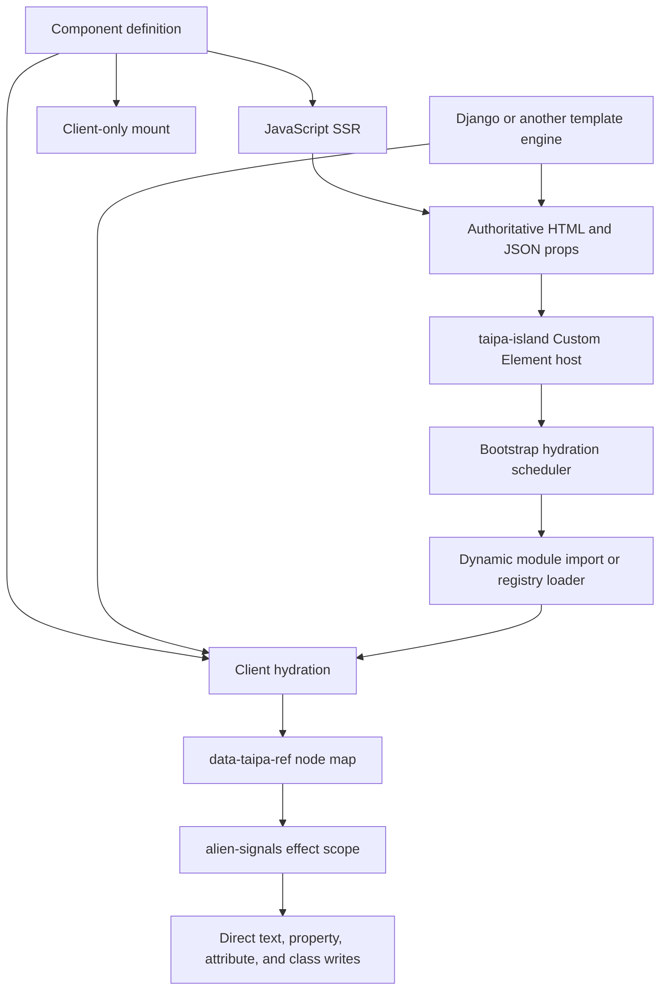

# Taipa UI Framework: first design draft

`@taipa/ui` is the working package name.

The central bet is simple: server HTML is authoritative, hydration attaches behavior to it, and reactive updates write directly to retained DOM node references.
`render()` is not an update loop.
There is no Virtual DOM, template-tree diff, DOM-shape reconciliation, or compiler requirement.

---

## 1. Goals and non-goals

### Goals

- Render the same component definition on a JavaScript server and in the browser.
- Hydrate existing HTML without recreating, comparing, or replacing the server DOM.
- Make Django the v1 golden-path foreign server while defining a server-neutral markup contract that other ecosystems can implement.
- Use `stackblitz/alien-signals` as the signal graph and effect lifecycle.
- Make SSR and progressive enhancement normal paths, not compatibility modes.
- Ship as `npm install @taipa/ui` and as browser-native ESM through `https://esm.sh/@taipa/ui@<version>`.
- Support four hydration policies: `load`, `idle`, `visible`, and `only`.
- Give forms a standalone progressive-enhancement API that starts from a real `<form>`.
- Keep the core understandable enough that a developer can trace every DOM write.

### Non-goals

- No Virtual DOM or VDOM-shaped intermediate tree.
- No rerunning `render()` after a signal changes.
- No generic keyed-list reconciler in v1.
- No generic structural directives that insert, remove, or reorder arbitrary reactive subtrees.
- No compiler, Babel plugin, JSX transform, or required bundler.
- No client router, app shell, server actions protocol, global store, CSS-in-JS system, or animation system in core.
- No attempt to make arbitrary server markup hydratable without explicit `data-taipa-ref` hooks.
- No transparent serialization of every signal. Props and snapshots are opt-in public data.
- No Shadow DOM by default. Light DOM is the interoperability baseline.
- No automatic interception of every form submission. A form remains a normal native form unless its enhancement explicitly supplies a client submit handler.

### Opinionated boundary

Taipa is for islands and enhanced server pages, not for reproducing a single-page application framework without a VDOM.
If a screen requires large, continuously reordered client-owned trees, use imperative DOM code inside one island, split the UI into smaller Custom Elements, or choose a different framework.

---

## 2. Architecture

### 2.1 Component model

A component definition has five layers:

1. Props: immutable input serialized by the server.
2. State: alien-signals writable signals created per component instance.
3. Derived values: alien-signals computed accessors.
4. Render: a server-safe function that produces escaped HTML for SSR or a one-time client-only mount.
5. Connection: events, bindings, and effects attached to existing DOM nodes.

The builder shape follows Ilha's readable `.state().derived().on().effect().render()` progression.
The major deviation is that Taipa separates initial HTML production from subsequent DOM updates.
Ilha documents a render function that can run again after signal changes; Taipa's `render()` runs only for SSR or initial client-only creation.

```ts
import { component, html } from "@taipa/ui";

export const Counter = component<{ initial: number }>("Counter", {
  contractVersion: "1",
})
  .state("count", ({ props }) => props.initial)
  .derived("canDecrease", ({ state }) => state.count() > 0)
  .on("increment@click", ({ state }) => {
    state.count(state.count() + 1);
  })
  .on("decrement@click", ({ state, derived }) => {
    if (derived.canDecrease()) state.count(state.count() - 1);
  })
  .bind("count", ({ element, state }) => {
    element.textContent = String(state.count());
  })
  .bind("decrement", ({ element, derived }) => {
    element.toggleAttribute("disabled", !derived.canDecrease());
  })
  .render(
    ({ state }) => html`
      <button type="button" data-taipa-ref="decrement">−</button>
      <output data-taipa-ref="count">${state.count()}</output>
      <button type="button" data-taipa-ref="increment">+</button>
    `,
  );
```

### 2.2 Runtime topology



### 2.3 Hydration model

Hydration never calls `render()` and never compares a client tree with the server tree.

For each `<taipa-island>` host, hydration:

1. Parses props and an optional state snapshot from inert `application/json` scripts.
2. Creates the component's state signals and computed values.
3. Scans the host for `data-taipa-ref` nodes, excluding nested `<taipa-island>` boundaries.
4. Preflights the component contract version and every required singular ref before attaching behavior.
5. Attaches `.on()` listeners directly to the referenced nodes.
6. Runs each `.bind()` inside an alien-signals `effect()`.
7. Runs component `.effect()` registrations inside one alien-signals `effectScope()`.
8. Stores the live instance in a `WeakMap<HTMLElement, ComponentInstance>`.
9. Dispatches `taipa:hydrated`.

When a signal changes, only effects that read that signal rerun.
A binding already holds its real `Element`, so the update is a direct browser API call such as `textContent =`, `value =`, `toggleAttribute()`, `classList.toggle()`, or `style.setProperty()`.

### 2.4 Island boundaries

- `<taipa-island>` is a generic autonomous Custom Element used as the lifecycle and scheduling boundary.
- Nested islands are independent. Parent ref discovery and event attachment stop at nested island hosts.
- An island owns behavior inside its boundary but does not own all markup inside it. Server templates may add static content that the component never touches.
- Ref names are component-local and may be repeated across separate islands.
- Refs targeted by `.bind()` or `.on()` are singular and must occur exactly once. Repeated refs are available only through `refs.all()` in `.connected()` or `.effect()`.
- A missing or duplicated required ref, an absent contract version, or a version mismatch aborts hydration before any listener or effect is attached. The island remains inert and dispatches `taipa:error`.
- A hydrated island's interior is immutable until explicit `unmount()`. Server-driven tools must unmount, replace the interior, then call `scan()` or `hydrate()` again.
- Removing an island disconnects its listeners, aborts async work, and stops its alien-signals effect scope.
- Cleanup after a transient DOM move is deferred to a microtask and canceled if the host reconnects.
- One compatible Taipa runtime major may own a document. Multiple widgets must share an exact runtime URL through npm resolution or an import map.

### 2.5 SSR and foreign-server HTML

Taipa supports two server paths:

**Native isomorphic SSR**

A JavaScript runtime imports the component and calls `renderIsland()`.
The component's own `render()` creates the inner HTML.

**Contract-compatible foreign SSR**

Django or another non-JavaScript server emits the same host, props, and ref contract itself.
The client component hydrates that markup without requiring the server to execute JavaScript.

The second path is not byte-identical isomorphism: Django can render different static markup than the component's `render()` function.
The compatibility guarantee is narrower and testable: required refs, public props, form controls, and island boundaries must agree.
Django contract hydration is the v1 golden path.
Rails, Laravel, Go, CMS, and static-generator adapters are future conformance targets, not supported integrations until they run the same portable contract fixtures.

### 2.6 Template and DOM strategy

`html` is a server-safe tagged template that escapes interpolated values and returns an opaque `SafeHtml`.
It is not a reactive template engine.

The accepted interpolation grammar is intentionally narrow:

- Text-node interpolation.
- Quoted attribute-value interpolation.
- Nested `SafeHtml` only in child-content positions.
- No dynamic tag names, attribute names, unquoted attributes, inline event-handler attributes, `script`, or `style` interpolation.
- URL-bearing attributes accept only values produced by `safeUrl()`.

Unsupported contexts throw during development and SSR rather than guessing.

For SSR, `SafeHtml` is serialized to a string.
For `client:only`, it is parsed once through a native `<template>` element and cloned into the host.
After that one-time mount, bindings operate on retained nodes.

This design deliberately avoids comment-marker parts, runtime expression slots, and template-range reconciliation.
Those techniques are not necessarily VDOMs, but they create a second update model that is too easy to evolve into a diffing layer.

### 2.7 Light DOM versus Shadow DOM

Recommendation: light DOM only in v1.

| Option                            | Trade-off                                                                                                                                                                  |
| --------------------------------- | -------------------------------------------------------------------------------------------------------------------------------------------------------------------------- |
| Light DOM — recommended           | Works naturally with Django form CSS, labels, accessibility tooling, server selectors, global design tokens, and nested server content. Styling is not encapsulated.       |
| Declarative Shadow DOM            | SSR-capable through `<template shadowrootmode="open">`, but complicates server templates, form styling, cross-boundary labels, ref discovery, and progressive enhancement. |
| Optional per-component Shadow DOM | Flexible but doubles the hydration and styling test matrix before the core contract is proven.                                                                             |

Declarative Shadow DOM remains a plausible later adapter because browsers can attach a server-emitted shadow root while parsing HTML.
It should not define the first release.

### 2.8 Server/client module split

The npm package is ESM-only and exposes four explicit entry points:

```json
{
  "name": "@taipa/ui",
  "type": "module",
  "sideEffects": false,
  "exports": {
    ".": {
      "types": "./dist/index.d.ts",
      "import": "./dist/index.js"
    },
    "./client": {
      "types": "./dist/client.d.ts",
      "import": "./dist/client.js"
    },
    "./server": {
      "types": "./dist/server.d.ts",
      "import": "./dist/server.js"
    },
    "./forms": {
      "types": "./dist/forms.d.ts",
      "import": "./dist/forms.js"
    }
  }
}
```

- `@taipa/ui`: universal component definitions, HTML escaping, and signal exports. No `window`, `document`, or Node imports at module evaluation.
- `@taipa/ui/client`: Custom Element lifecycle, bootstrap scheduling, module loading, hydration, and client-only mount.
- `@taipa/ui/server`: string SSR and island wrapper serialization. No DOM shim.
- `@taipa/ui/forms`: browser form enhancement. It may import universal signal primitives but not the island bootstrap.

The package publishes native ESM plus declarations and defines every subpath in `exports`.
This shape is friendly to npm, Node, Deno, browsers through esm.sh, and esm.sh's package-boundary bundling.
Every page must resolve one compatible runtime major; the bootstrapper coordinates through a global symbol and rejects an incompatible second owner.

### 2.9 Reactivity policy

Taipa uses `alien-signals` rather than wrapping it in a competing reactive graph.

- `signal`, `computed`, `effect`, and `effectScope` are direct re-exports.
- Each hydrated island owns one effect scope.
- `.bind()` and `.effect()` register inside that scope.
- `batch()` is a small `startBatch()` / `endBatch()` wrapper with `try/finally`.
- Framework code does not replace alien-signals scheduling or dependency tracking.
- The package pins one supported alien-signals major and tests against the exact installed version.

### 2.10 Reference alignment

**Ilha**

Taipa follows Ilha's island boundary, fluent builder, signal vocabulary, isomorphic component definition, `html` tagged template, and Custom Element compatibility.
These choices make small components readable and keep server and client behavior in one module.

Taipa deviates by making `render()` initial-only, making ref-based bindings the sole update mechanism, choosing tagged templates over JSX as the primary API, omitting router/store/CSS features, and treating foreign-server markup as a first-class contract.
The deviations protect the no-diffing constraint and the no-build distribution path.

Reference: [Ilha introduction](https://ilha.build/guide/getting-started/introduction/), [Ilha core concepts](https://ilha.build/guide/getting-started/core-concepts/), [Ilha hydration](https://ilha.build/guide/island/hydratable/), and [Ilha mount](https://ilha.build/guide/helpers/mount/).

**alien-signals**

Taipa follows the library's callable signals, computed accessors, cleanup-returning effects, effect scopes, and batching primitives.
It does not add proxy-based state, deep observation, or a custom scheduler.

Reference: [stackblitz/alien-signals](https://github.com/stackblitz/alien-signals).

**Astro client directives**

Taipa preserves the user-visible semantics of immediate, idle, visible, and client-only activation.
It deviates by encoding the decision in final HTML and resolving it at runtime, because there is no compiler to consume and erase `client:*` syntax.

Reference: [Astro client directives](https://docs.astro.build/en/reference/directives-reference/#client-directives).

---

## 3. Public API

The first release has no default export and no import-time auto-bootstrap.
The signatures below are the complete proposed function surface.

### 3.1 Shared types

```ts
export type MaybePromise<T> = T | Promise<T>;
export type Cleanup = () => void;
export type JsonPrimitive = string | number | boolean | null;
export type JsonValue =
  JsonPrimitive | readonly JsonValue[] | { readonly [key: string]: JsonValue };
export type JsonObject = { readonly [key: string]: JsonValue };

export type Signal<T> = {
  (): T;
  (value: T): void;
};

export type ReadSignal<T> = () => T;
export type StateSignals<S> = { readonly [K in keyof S]: Signal<S[K]> };
export type DerivedSignals<D> = { readonly [K in keyof D]: ReadSignal<D[K]> };

export interface SafeHtml {
  readonly value: string;
  readonly __brand: "SafeHtml";
}

export interface SafeUrl {
  readonly value: string;
  readonly __brand: "SafeUrl";
}

export interface RefMap {
  one<T extends Element = Element>(name: string): T;
  optional<T extends Element = Element>(name: string): T | null;
  all<T extends Element = Element>(name: string): readonly T[];
}

export interface ReactiveContext<P, S, D> {
  readonly props: Readonly<P>;
  readonly state: StateSignals<S>;
  readonly derived: DerivedSignals<D>;
}

export interface ClientContext<P, S, D> extends ReactiveContext<P, S, D> {
  readonly host: HTMLElement;
  readonly refs: RefMap;
  readonly signal: AbortSignal;
}

export interface Component<P, S, D> {
  readonly name: string;
  readonly contractVersion: string;
  readonly requiredRefs: readonly string[];
}
```

### 3.2 `@taipa/ui`

```ts
export interface ComponentOptions {
  readonly contractVersion: string;
}

export function component<P extends JsonObject = Record<string, never>>(
  name: string,
  options: ComponentOptions,
): ComponentBuilder<P, Record<string, never>, Record<string, never>>;

export function html(strings: TemplateStringsArray, ...values: readonly unknown[]): SafeHtml;

export function raw(trustedHtml: string): SafeHtml;

export function safeUrl(
  value: string,
  options?: {
    readonly protocols?: readonly string[];
    readonly allowRelative?: boolean;
  },
): SafeUrl;

export function signal<T>(): Signal<T | undefined>;
export function signal<T>(initialValue: T): Signal<T>;

export function computed<T>(getter: (previousValue?: T) => T): ReadSignal<T>;

export function effect(run: () => void | Cleanup): Cleanup;

export function effectScope(run: () => void): Cleanup;

export function batch<T>(run: () => T): T;
```

`raw()` is intentionally alarming and accepts only already-sanitized or fully trusted markup.
`html` supports text interpolation and quoted attribute-value interpolation; nested `SafeHtml` is accepted only as child content; `null` and `undefined` render nothing; arrays flatten.
Dynamic tag names, attribute names, unquoted attributes, inline handlers, and raw-text element interpolation are rejected.
URL-bearing attributes reject plain strings and accept only `SafeUrl`; the default permits relative URLs plus `http:`, `https:`, `mailto:`, and `tel:`.

### 3.3 Component builder

Builder methods are part of the public API even though they are not top-level exports.
`.render()` finalizes the chain and must be last.

```ts
export interface ComponentBuilder<P, S, D> {
  state<K extends string, V>(
    name: Exclude<K, keyof S>,
    initial: V | ((context: { readonly props: Readonly<P> }) => V),
  ): ComponentBuilder<P, S & Record<K, V>, D>;

  derived<K extends string, V>(
    name: Exclude<K, keyof D>,
    read: (context: ReactiveContext<P, S, D>) => V,
  ): ComponentBuilder<P, S, D & Record<K, V>>;

  on<E extends Event = Event>(
    spec: `@${string}` | `${string}@${string}`,
    handler: (
      context: ClientContext<P, S, D> & {
        readonly event: E;
        readonly target: Element;
      },
    ) => MaybePromise<void>,
    options?: AddEventListenerOptions,
  ): ComponentBuilder<P, S, D>;

  bind(
    refName: string,
    update: (
      context: ClientContext<P, S, D> & {
        readonly element: Element;
      },
    ) => void | Cleanup,
  ): ComponentBuilder<P, S, D>;

  effect(run: (context: ClientContext<P, S, D>) => void | Cleanup): ComponentBuilder<P, S, D>;

  connected(run: (context: ClientContext<P, S, D>) => void | Cleanup): ComponentBuilder<P, S, D>;

  render(view: (context: ReactiveContext<P, S, D>) => MaybePromise<SafeHtml>): Component<P, S, D>;
}
```

Semantics:

- `.on("save@click", handler)` targets `data-taipa-ref="save"`.
- `.on("@click", handler)` targets the island host.
- `.bind()` is an alien-signals effect with one retained element reference.
- `.effect()` is reactive and client-only.
- `.connected()` runs once per real connection and does not track signals.
- Event handlers receive an `AbortSignal` aborted on unmount.
- A binding cleanup runs before the binding reruns and on unmount.
- Derived functions are synchronous in v1. Async data belongs in props or a client effect.

### 3.4 `@taipa/ui/server`

```ts
export interface RenderOptions<S> {
  readonly state?: Partial<S>;
}

export type HydrationPolicy = false | "load" | "idle" | "visible" | "only";

export interface IslandRenderOptions<S> extends RenderOptions<S> {
  readonly id?: string;
  readonly hydrate?: HydrationPolicy;
  readonly module?: string;
  readonly exportName?: string;
  readonly idleTimeout?: number;
  readonly visibleRootMargin?: string;
  readonly fallback?: SafeHtml;
}

export function renderToString<P, S, D>(
  component: Component<P, S, D>,
  props: P,
  options?: RenderOptions<S>,
): Promise<string>;

export function renderIsland<P, S, D>(
  component: Component<P, S, D>,
  props: P,
  options?: IslandRenderOptions<S>,
): Promise<string>;
```

`renderToString()` returns inner HTML only.
`renderIsland()` returns the `<taipa-island>` host, inner HTML or `client:only` fallback, props JSON, optional state JSON, and scheduling attributes.
Hydratable props must satisfy `JsonObject`.
State overrides are validated recursively at serialization time and throw if a value is not JSON-safe.

No streaming API is promised in v1.
The internal renderer should avoid preventing a later `renderToStream()` addition.

### 3.5 `@taipa/ui/client`

```ts
export type ComponentModule<P = object, S = object, D = object> =
  | Component<P, S, D>
  | {
      readonly default?: Component<P, S, D>;
      readonly [exportName: string]: unknown;
    };

export type ComponentLoader = () => Promise<ComponentModule>;

export interface RegistryEntry {
  readonly load: ComponentLoader;
  readonly exportName?: string;
}

export type ComponentRegistry = Readonly<Record<string, ComponentLoader | RegistryEntry>>;

export interface BootstrapOptions {
  readonly root?: ParentNode;
  readonly registry?: ComponentRegistry;
  readonly observe?: boolean;
  readonly resolveDomModule?: (specifier: string, host: HTMLElement) => ComponentLoader | null;
  readonly onError?: (error: unknown, host: HTMLElement) => void;
}

export interface BootstrapHandle {
  scan(root?: ParentNode): void;
  destroy(): void;
}

export interface HydrateOptions<P, S> {
  readonly props?: P;
  readonly state?: Partial<S>;
}

export interface MountOptions<P, S> extends HydrateOptions<P, S> {
  readonly replace?: boolean;
}

export interface ComponentInstance<P, S, D> {
  readonly host: HTMLElement;
  readonly props: Readonly<P>;
  readonly state: StateSignals<S>;
  readonly derived: DerivedSignals<D>;
  destroy(): void;
}

export function bootstrap(options?: BootstrapOptions): BootstrapHandle;

export function hydrate<P, S, D>(
  host: HTMLElement,
  component: Component<P, S, D>,
  options?: HydrateOptions<P, S>,
): ComponentInstance<P, S, D>;

export function mount<P, S, D>(
  host: HTMLElement,
  component: Component<P, S, D>,
  options: MountOptions<P, S>,
): Promise<ComponentInstance<P, S, D>>;

export function unmount(host: HTMLElement): boolean;
```

`bootstrap()` defines `<taipa-island>`, scans existing hosts, schedules them, and optionally observes added hosts with `MutationObserver`.
It is side-effect free until called.
`BootstrapHandle.destroy()` stops discovery and pending schedules and unmounts live instances owned by that handle.

`hydrate()` attaches to existing children.
`mount()` calls `render()` once, parses the result through `<template>`, installs the children, and then hydrates them.
`unmount()` returns `false` if the host has no live instance.

### 3.6 `@taipa/ui/forms`

```ts
export type FormErrors = Readonly<Record<string, readonly string[]>>;
export type ValidationMode = "submit" | "blur" | "input";

export interface FormReadContext {
  readonly form: HTMLFormElement;
  readonly formData: FormData;
}

export interface FormValidationContext<T> {
  readonly form: HTMLFormElement;
  readonly values: Readonly<T>;
  readonly formData: FormData;
  readonly signal: AbortSignal;
}

export interface FormSubmitContext<T> extends FormValidationContext<T> {
  setErrors(errors: FormErrors): void;
}

export interface CreateFormOptions<T> {
  readonly read: (context: FormReadContext) => T;
  readonly validate?: (context: FormValidationContext<T>) => MaybePromise<FormErrors | void>;
  readonly mode?: ValidationMode;
  readonly submit?: (context: FormSubmitContext<T>) => MaybePromise<void>;
}

export interface FormController<T> {
  readonly values: ReadSignal<Readonly<T>>;
  readonly errors: ReadSignal<FormErrors>;
  readonly dirty: ReadSignal<boolean>;
  readonly touched: ReadSignal<ReadonlySet<string>>;
  readonly validating: ReadSignal<boolean>;
  readonly submitting: ReadSignal<boolean>;
  readonly valid: ReadSignal<boolean>;

  validate(fieldNames?: readonly string[]): Promise<boolean>;
  setErrors(errors: FormErrors): void;
  setValue(name: string, value: string | File | readonly string[]): void;
  reset(): void;
  destroy(): void;
}

export function createForm<T>(
  form: HTMLFormElement,
  options: CreateFormOptions<T>,
): FormController<T>;
```

There are no exported validator helpers in v1.
Native HTML constraints handle common cases; application validation stays explicit; Standard Schema support can be added later as an adapter rather than a hard dependency.

---

## 4. Hydration directives

### 4.1 Resolution

Yes: Astro-style hydration policies can work with HTML from an unaware template engine.
They become runtime data rather than compiler directives.

The canonical attribute is:

```html
data-taipa-hydrate="load | idle | visible | only"
```

No attribute means static HTML with no client activation.

Taipa should not accept literal `client:load` attributes as its primary contract.
Astro's colon syntax is compiler input and is absent from final HTML.
Using one normalized data attribute makes the runtime state explicit, serializable, inspectable, and easy for any template language to emit.

### 4.2 Scheduling semantics

| Taipa value | Runtime behavior                                                                                                                                                                                                                      |
| ----------- | ------------------------------------------------------------------------------------------------------------------------------------------------------------------------------------------------------------------------------------- |
| `load`      | Resolve and import the component as soon as `bootstrap()` discovers the host.                                                                                                                                                         |
| `idle`      | Wait for `requestIdleCallback({ timeout })`; fall back to the window `load` event plus `setTimeout(0)`.                                                                                                                               |
| `visible`   | Observe the host with `IntersectionObserver`; import and hydrate once it intersects the configured root margin.                                                                                                                       |
| `only`      | Import immediately and render off-DOM. After rendering succeeds, atomically replace the optional `[data-taipa-fallback]` element and connect bindings. If loading or rendering fails, retain the fallback and dispatch `taipa:error`. |

Recommended default for `visible` is `rootMargin: "200px 0px"`.
Astro's semantic promise is visibility-triggered hydration; Taipa intentionally starts slightly before the host reaches the viewport to hide network latency.

### 4.3 Module resolution

Two mechanisms coexist:

**Page registry — recommended**

```html
<script type="application/json" id="taipa-registry">
  {
    "Counter": {
      "src": "/static/components/counter.js",
      "export": "Counter"
    }
  }
</script>
```

The bootstrapper parses this inert registry and resolves short component names.
A JavaScript registry passed directly to `bootstrap({ registry })` overrides the JSON registry and supports loader functions.

**Per-island module URL — universal fallback**

```html
<taipa-island
  data-taipa-component="Counter"
  data-taipa-src="/static/components/counter.js"
  data-taipa-export="Counter"
  data-taipa-hydrate="load"
  data-taipa-version="1"
></taipa-island>
```

Per-island URLs work in a CMS fragment or a page that cannot modify the global layout.
They are disabled by default.
An application must provide `resolveDomModule(specifier, host)` and return an approved loader for exact paths or allowlisted URLs.
Origin checks alone are insufficient because same-origin uploaded or generated files may still be unsafe modules.

If both exist, the JavaScript registry wins, then the JSON registry, then `data-taipa-src`.

### 4.4 Markup contract

```html
<taipa-island
  id="cart-summary"
  data-taipa-component="CartSummary"
  data-taipa-hydrate="visible"
  data-taipa-visible-root-margin="300px 0px"
  data-taipa-version="1"
>
  <p>
    <span data-taipa-ref="quantity">2</span>
    items
  </p>
  <button type="button" data-taipa-ref="checkout">Checkout</button>

  <script type="application/json" data-taipa-props>
    { "cartId": "cart_123" }
  </script>

  <script type="application/json" data-taipa-state>
    { "quantity": 2 }
  </script>
</taipa-island>
```

Contract rules:

- `data-taipa-component` is required.
- `data-taipa-hydrate` is optional; omission means never hydrate.
- `data-taipa-version` is required whenever `data-taipa-hydrate` is present and must equal the loaded component's `contractVersion`.
- One module source must be resolvable from a registry or `data-taipa-src`.
- `data-taipa-export` defaults to `default`.
- Props JSON is required for hydrating components with non-empty props.
- State JSON is optional and contains only explicitly provided state overrides.
- A `client:only` fallback, when present, is one element carrying `data-taipa-fallback`; the bootstrapper keeps it visible until off-DOM rendering succeeds, then replaces it atomically.
- JSON must escape `<`, `>`, `&`, U+2028, U+2029, and the sequence `</script`.
- `data-taipa-version` is the component markup-contract version, not the npm version.
- `data-taipa-ref` names are scoped to the nearest island.
- Props, state, module URLs, and hydration attributes must never be derived from untrusted user HTML.

### 4.5 Worked Django template tag

The optional Django adapter should expose one block-rendering tag:

```django



```

`components/counter_inner.html`:

```django
<button type="button" data-taipa-ref="decrement">−</button>
<output data-taipa-ref="count">{{ initial }}</output>
<button type="button" data-taipa-ref="increment">+</button>
```

The tag:

1. Resolves the named component in Django settings.
2. Renders the inner Django template with `props`.
3. Emits the host attributes.
4. Serializes props using Django's `json_script` escaping rules.
5. Omits `data-taipa-src` when the page registry can resolve the component.
6. Rejects unknown hydration values at template-render time.

The adapter and browser share one generated or hand-maintained JSON manifest.
Django loads this file from a configured filesystem path; the base template emits the same data as `#taipa-registry`.

```json
{
  "Counter": {
    "src": "/static/components/counter.js",
    "export": "default",
    "contractVersion": "1"
  }
}
```

Exact output:

```html
<taipa-island data-taipa-component="Counter" data-taipa-hydrate="load" data-taipa-version="1">
  <button type="button" data-taipa-ref="decrement">−</button>
  <output data-taipa-ref="count">3</output>
  <button type="button" data-taipa-ref="increment">+</button>
  <script type="application/json" data-taipa-props>
    { "initial": 3 }
  </script>
</taipa-island>
```

The tag is convenience, not a privileged integration.
Any server that emits this contract is equally supported.

### 4.6 What is lost compared with Astro

- No build-time validation that the component exists or exports the requested name.
- No compiler-owned module graph, chunk naming, tree shaking across application modules, or automatic preload generation.
- No automatic guarantee that the server markup and client component came from the same source revision.
- No removal of directive metadata from final HTML; Taipa needs the attributes at runtime.
- No framework auto-detection for `only`; Taipa loads only Taipa components, so the framework value is unnecessary.
- No build-time error for a dynamic or malformed directive hidden in template data.
- The bootstrap module itself must load before any policy can be scheduled.
- `visible` normally delays the network request as well as hydration unless the server emits `<link rel="modulepreload">`.

What can be recovered:

- A Django/Vite integration can generate the registry from a manifest.
- Production templates can emit `modulepreload` links for `load` islands and near-fold `visible` islands.
- CI can render server templates and verify component names, contract versions, required refs, and registry entries.
- Registry-only configuration is the secure default; `resolveDomModule()` is the explicit capability boundary for DOM-provided module URLs.

---

## 5. Forms API

### 5.1 Design

`createForm()` enhances a real server-rendered `<form>`.
The form element and its controls remain the source of truth.

Taipa does not replace inputs with controlled components.
It reads `FormData`, mirrors values into signals, runs validation, and writes errors back into existing error containers.

Default behavior:

- Preserve `method`, `action`, native submission, CSRF fields, buttons, labels, browser autofill, and browser constraint validation.
- Listen to native `input`, `change`, `blur`, `reset`, and `submit`.
- Use event delegation on the form rather than one listener per control.
- Seed touched/error state from server-rendered `aria-invalid` attributes and error containers.
- Set `aria-invalid`, preserve or add `aria-describedby`, and update `[data-taipa-error-for="<name>"]`.
- Render every validation message with `textContent`; error strings are never interpreted as HTML or passed to `raw()`.
- Treat field error containers as polite live regions and the form-level error container as an assertive status.
- On a failed submit, focus the first invalid control; applications may replace this with a linked error summary.
- Abort stale async validation when a newer validation starts.
- Expose `validating()` and set `aria-busy="true"` while submit-triggered validation is pending.
- Update an optional `[data-taipa-form-status]` live region with validation and submission status.
- Disable only submit controls carrying `data-taipa-disable-while-submitting`.
- Do not intercept submission unless `options.submit` exists.

When `submit` is absent:

1. Synchronous or async validation may temporarily prevent submission.
2. Taipa captures the original submitter and marks the validation generation.
3. If valid, Taipa calls `requestSubmit(originalSubmitter)` with a one-shot bypass flag consumed by the second submit event.
4. The server remains authoritative.

When `submit` exists:

1. Taipa validates.
2. It prevents native submission.
3. It calls the supplied handler with the real `FormData`, including CSRF tokens and file fields.
4. The handler decides how to process success, redirects, and server-returned errors.

Network failure must not automatically replay a non-idempotent POST through native submission.
The handler should show an error and let the user explicitly retry.

### 5.2 Validation policy

Recommendation: browser constraints first, explicit application validator second.

- Native constraints cover `required`, `type=email`, `min`, `max`, `pattern`, and similar rules.
- `validate()` handles cross-field and domain rules.
- The server repeats all authoritative validation.
- Client and server error shapes are `Record<string, string[]>`, using `"__all__"` for form-level errors.
- `input` validation should be reserved for cheap local rules.
- Async remote validation should run on `blur` or `submit`, not every keystroke.
- Input and blur validation may compute all errors but display only errors for touched fields.
- Submit validation displays all field and `__all__` errors; changing a field clears only errors made stale by the next completed validation generation.

### 5.3 Example

Server-rendered HTML:

```html
<form method="post" action="/accounts/register/" data-taipa-form="registration">
  <input type="hidden" name="csrfmiddlewaretoken" value="token" />

  <label for="id_email">Email</label>
  <input
    id="id_email"
    name="email"
    type="email"
    value="already@example.com"
    required
    aria-describedby="id_email_errors"
  />
  <p id="id_email_errors" data-taipa-error-for="email" role="status" aria-live="polite"></p>

  <label for="id_password">Password</label>
  <input
    id="id_password"
    name="password"
    type="password"
    minlength="12"
    required
    aria-describedby="id_password_errors"
  />
  <p id="id_password_errors" data-taipa-error-for="password" role="status" aria-live="polite"></p>

  <p data-taipa-error-for="__all__" role="alert" aria-live="assertive"></p>
  <p data-taipa-form-status role="status" aria-live="polite"></p>

  <button type="submit" data-taipa-disable-while-submitting>Create account</button>
</form>
```

Client enhancement:

```ts
import { createForm, type FormErrors } from "@taipa/ui/forms";

type RegistrationValues = {
  email: string;
  password: string;
};

const formElement = document.querySelector<HTMLFormElement>('[data-taipa-form="registration"]')!;

const registration = createForm<RegistrationValues>(formElement, {
  mode: "blur",

  read: ({ formData }) => ({
    email: String(formData.get("email") ?? "").trim(),
    password: String(formData.get("password") ?? ""),
  }),

  validate: ({ values }) => {
    const errors: Record<string, string[]> = {};

    if (!values.email.endsWith("@example.com")) {
      errors.email = ["Use your example.com address."];
    }

    if (values.password.toLowerCase().includes(values.email.split("@")[0])) {
      errors.password = ["Password must not contain your email name."];
    }

    return errors;
  },

  submit: async ({ form, formData, signal, setErrors }) => {
    const response = await fetch(form.action, {
      method: form.method,
      body: formData,
      signal,
      headers: {
        "X-Requested-With": "XMLHttpRequest",
      },
    });

    if (response.status === 422) {
      const body = (await response.json()) as { errors: FormErrors };
      setErrors(body.errors);
      return;
    }

    if (!response.ok) {
      setErrors({ __all__: ["Could not create the account. Try again."] });
      return;
    }

    const body = (await response.json()) as { redirect: string };
    location.assign(body.redirect);
  },
});
```

Without JavaScript, the same form posts normally and Django renders its normal validation response.

---

## 6. Worked examples

### 6.1 Counter island in a Django template

Django template:

```django



```

Server output:

```html
<taipa-island data-taipa-component="Counter" data-taipa-hydrate="load" data-taipa-version="1">
  <button type="button" data-taipa-ref="decrement">−</button>
  <output data-taipa-ref="count">3</output>
  <button type="button" data-taipa-ref="increment">+</button>
  <script type="application/json" data-taipa-props>
    { "initial": 3 }
  </script>
</taipa-island>
```

Client component:

```ts
import { component, html } from "@taipa/ui";

export const Counter = component<{ initial: number }>("Counter", {
  contractVersion: "1",
})
  .state("count", ({ props }) => props.initial)
  .derived("canDecrease", ({ state }) => state.count() > 0)
  .on("increment@click", ({ state }) => {
    state.count(state.count() + 1);
  })
  .on("decrement@click", ({ state, derived }) => {
    if (derived.canDecrease()) state.count(state.count() - 1);
  })
  .bind("count", ({ element, state }) => {
    element.textContent = String(state.count());
  })
  .bind("decrement", ({ element, derived }) => {
    element.toggleAttribute("disabled", !derived.canDecrease());
  })
  .render(
    ({ state }) => html`
      <button type="button" data-taipa-ref="decrement">−</button>
      <output data-taipa-ref="count">${state.count()}</output>
      <button type="button" data-taipa-ref="increment">+</button>
    `,
  );

export default Counter;
```

Page bootstrap:

```ts
import { bootstrap } from "@taipa/ui/client";

bootstrap({
  registry: {
    Counter: () => import("/static/components/counter.js"),
  },
});
```

The server's `<output>` node survives hydration.
Only its `textContent` changes after a click.

### 6.2 Form with validation

Server output:

```html
<form method="post" action="/newsletter/" data-taipa-form="newsletter">
  <input type="hidden" name="csrfmiddlewaretoken" value="token" />
  <label for="newsletter-email">Email</label>
  <input
    id="newsletter-email"
    name="email"
    type="email"
    required
    aria-describedby="newsletter-email-error"
  />
  <p id="newsletter-email-error" data-taipa-error-for="email" role="status" aria-live="polite"></p>
  <p data-taipa-form-status role="status" aria-live="polite"></p>
  <button type="submit" data-taipa-disable-while-submitting>Subscribe</button>
</form>
```

Client code:

```ts
import { createForm } from "@taipa/ui/forms";

const element = document.querySelector<HTMLFormElement>('[data-taipa-form="newsletter"]')!;

createForm(element, {
  mode: "blur",
  read: ({ formData }) => ({
    email: String(formData.get("email") ?? "").trim(),
  }),
  validate: ({ values }) =>
    values.email.includes("+") ? { email: ["Plus-addresses are not accepted for this list."] } : {},
});
```

Because no `submit` callback is supplied, a valid form still uses its native POST.

### 6.3 Component loaded through esm.sh with no build step

Server output:

```html
<taipa-island data-taipa-component="InlineCounter" data-taipa-hydrate="load" data-taipa-version="1">
  <button type="button" data-taipa-ref="increment">Increment</button>
  <output data-taipa-ref="count">0</output>
</taipa-island>
```

Browser module:

```ts
import { component, html } from "https://esm.sh/@taipa/ui@0.1.0?target=es2022";
import { bootstrap } from "https://esm.sh/@taipa/ui@0.1.0/client?target=es2022";

const InlineCounter = component("InlineCounter", {
  contractVersion: "1",
})
  .state("count", 0)
  .on("increment@click", ({ state }) => {
    state.count(state.count() + 1);
  })
  .bind("count", ({ element, state }) => {
    element.textContent = String(state.count());
  })
  .render(
    ({ state }) => html`
      <button type="button" data-taipa-ref="increment">Increment</button>
      <output data-taipa-ref="count">${state.count()}</output>
    `,
  );

bootstrap({
  registry: {
    InlineCounter: async () => ({ default: InlineCounter }),
  },
});
```

This source is valid TypeScript and browser JavaScript because it uses no type-only syntax.
Production documentation should pin an exact package version.
An import map is recommended when several modules import Taipa so every module resolves the same URL.

### 6.4 Hydrate only when scrolled into view

Server output:

```html
<taipa-island
  data-taipa-component="PriceHistory"
  data-taipa-hydrate="visible"
  data-taipa-visible-root-margin="300px 0px"
  data-taipa-version="1"
>
  <section aria-labelledby="price-history-title">
    <h2 id="price-history-title">Price history</h2>
    <p data-taipa-ref="status">Chart becomes interactive near the viewport.</p>
    <canvas
      width="800"
      height="300"
      data-taipa-ref="canvas"
      aria-label="Price history chart"
    ></canvas>
  </section>
  <script type="application/json" data-taipa-props>
    { "endpoint": "/api/products/42/prices/" }
  </script>
</taipa-island>
```

Client component:

```ts
import { component, html } from "@taipa/ui";

export const PriceHistory = component<{ endpoint: string }>("PriceHistory", {
  contractVersion: "1",
})
  .state("status", "Loading chart…")
  .bind("status", ({ element, state }) => {
    element.textContent = state.status();
  })
  .connected(({ props, refs, state, signal }) => {
    const canvas = refs.one<HTMLCanvasElement>("canvas");
    const context = canvas.getContext("2d");

    void fetch(props.endpoint, { signal })
      .then((response) => response.json())
      .then((points: readonly number[]) => {
        if (!context) return;
        drawPriceHistory(context, points);
        state.status("Interactive chart loaded.");
      })
      .catch((error: unknown) => {
        if (signal.aborted) return;
        state.status("Chart data could not be loaded.");
        console.error(error);
      });
  })
  .render(
    () => html`
      <section aria-labelledby="price-history-title">
        <h2 id="price-history-title">Price history</h2>
        <p data-taipa-ref="status">Loading chart…</p>
        <canvas
          width="800"
          height="300"
          data-taipa-ref="canvas"
          aria-label="Price history chart"
        ></canvas>
      </section>
    `,
  );

export default PriceHistory;

function drawPriceHistory(context: CanvasRenderingContext2D, points: readonly number[]): void {
  context.beginPath();
  points.forEach((point, index) => {
    const x = index * 20;
    const y = 280 - point;
    if (index === 0) context.moveTo(x, y);
    else context.lineTo(x, y);
  });
  context.stroke();
}
```

Bootstrap:

```ts
import { bootstrap } from "@taipa/ui/client";

bootstrap({
  registry: {
    PriceHistory: () => import("/static/components/price-history.js"),
  },
});
```

The module is not requested until the host enters the `300px` observation margin.

---

## 7. Open questions and risks

### Decisions still worth prototyping

#### State serialization

1. Inert JSON scripts — recommended.
   They handle structured data, avoid attribute-size ergonomics, and can reuse mature server escaping.
2. JSON in `data-*` attributes.
   Simpler DOM shape, but quoting and inspection become painful for nested data.
3. One page-level state blob keyed by island ID.
   Smaller repeated markup, but makes streamed fragments and partial-page insertion harder.

Prototype target: verify safe escaping across Django, Node SSR, CSP policies, non-ASCII text, and hostile strings containing `</script>`.

#### Module registry source

1. JSON registry plus bootstrap resolver — recommended.
   Works without build tooling and keeps module URLs out of each island.
2. Per-island `data-taipa-src`.
   Best universal fallback, but repetitive and easier to inject incorrectly.
3. JavaScript-only registry.
   Best typing and loader control, but a template fragment cannot declare its dependency independently.

Prototype target: test registry entries, explicit DOM-module resolvers for exact local and esm.sh URLs, duplicate module requests, and dynamically inserted fragments.

#### Development contract validation

1. Required-ref and version validation — recommended.
   Cheap and aligned with the actual hydration contract.
2. Static HTML checksum.
   Detects more drift but creates false failures when Django legitimately adds static markup.
3. Full server/client DOM comparison.
   Rejected because it recreates a reconciliation mindset and undermines foreign-server ownership.

Prototype target: produce useful errors for missing refs, duplicate unique refs, nested-island leaks, unknown components, and contract-version mismatches.

### Risks

**Markup drift**

Django templates and component `render()` can diverge.
Required-ref checks catch missing hooks, not semantic differences such as wrong labels or initial text.
CI should render representative Django fixtures and hydrate them in a real browser.

**The ref model may feel repetitive**

Authors often write an initial value in `render()` and repeat the same expression in `.bind()`.
This duplication is intentional in v1 because it keeps updates explicit.
A future authoring helper is acceptable only if it still compiles to named refs and direct writes without introducing a template diff runtime.

**Dynamic collections**

The absence of a keyed list helper will be noticeable.
Prototype real examples such as editable line items, notifications, and search results.
If imperative DOM updates are consistently error-prone, consider a narrowly scoped collection primitive whose contract is explicit DOM insertion/removal, not arbitrary subtree diffing.

**Custom Element lifecycle**

DOM moves, cached page fragments, browser history restoration, and nested removals can produce surprising connect/disconnect sequences.
Test native moves, explicit unmount-before-`innerHTML` replacement, `DocumentFragment` insertion, Turbo/HTMX-style swaps, and back-forward cache restoration.

**Hydration races**

An island may be removed while its module is importing or while visible/idle scheduling is pending.
Every scheduled task and import completion must recheck `host.isConnected` and instance state before hydrating.

**CSP and cross-origin modules**

Dynamic import requires CSP and CORS permission.
The secure default is registry-only; DOM-provided module URLs do nothing without `resolveDomModule()`.
Documentation must show exact-path resolution for local modules, explicit esm.sh resolution, and self-hosting for stricter deployments.

**Version skew**

Server markup, a cached registry, and a client module can come from different deployments.
Missing or mismatched `data-taipa-version` leaves the island inert in every mode and dispatches `taipa:error`; development also logs a detailed diagnostic.
Hashed module URLs and cache-busted registries are strongly recommended.

**Serialization leaks**

Props and state are visible in page source.
The API and documentation must frame them as public data and make state snapshots explicit.

**Forms and duplicate submissions**

Async validation and enhanced submission create races among input, submitters, and network responses.
Use an AbortController per validation and submission generation, preserve the original submitter, and never automatically replay a failed POST.

**Accessibility regressions**

Direct DOM APIs make accessibility the component author's responsibility.
Core form behavior should own error association and busy state, while island docs should require native semantics before ARIA.

**SSR performance**

`renderToString()` is straightforward, but high-volume SSR, async render errors, and future streaming need benchmarks.
Prototype nested components, large escaped templates, concurrent requests, and abort propagation before claiming production SSR performance.

**alien-signals drift**

The project is active and its low-level API can evolve.
Pin a supported major, wrap batching only, and avoid importing private internals.

**No-build browser ergonomics**

Browser examples cannot use TypeScript-only syntax without a transform.
Documentation should write examples in the JavaScript subset of TypeScript, pin esm.sh URLs, and recommend import maps for multi-module pages.

### Prototype gates before implementation is considered stable

- Hydrate server HTML without changing node identity.
- Prove a signal update touches only the bound node or property.
- Hydrate the same component from Node SSR and Django-emitted HTML.
- Run one server-neutral HTML fixture through the public hydration conformance suite so future adapters have a portable target.
- Exercise all four hydration policies, including removal before activation.
- Confirm nested islands do not leak refs or event handlers.
- Confirm unmount stops alien-signals effects and aborts async work.
- Render and parse hostile props safely.
- Reject hostile template contexts, dynamic URL schemes, and unsafe `SafeUrl` inputs.
- Render validation messages containing HTML-like text without creating DOM nodes.
- Run the forms example with JavaScript disabled, enabled with native submission, enabled with async validation, and enabled with enhanced submission.
- Import every public entry point from npm, Node ESM, Deno, and esm.sh without a bundler.
- Measure bootstrap size, per-island overhead, hydration time, and retained memory after unmount.

### Research sources

- [Ilha introduction](https://ilha.build/guide/getting-started/introduction/)
- [Ilha core concepts](https://ilha.build/guide/getting-started/core-concepts/)
- [Ilha `.on()`](https://ilha.build/guide/island/on/)
- [Ilha hydration](https://ilha.build/guide/island/hydratable/)
- [Ilha Custom Element definition](https://ilha.build/guide/island/define/)
- [Ilha mount and lazy hydration](https://ilha.build/guide/helpers/mount/)
- [stackblitz/alien-signals](https://github.com/stackblitz/alien-signals)
- [Astro client directives](https://docs.astro.build/en/reference/directives-reference/#client-directives)
- [esm.sh documentation](https://esm.sh/)
- [MDN Custom Elements](https://developer.mozilla.org/en-US/docs/Web/API/Web_components/Using_custom_elements)
- [MDN Declarative Shadow DOM](https://developer.mozilla.org/en-US/docs/Web/API/Web_components/Using_shadow_DOM#declaratively_with_html)
